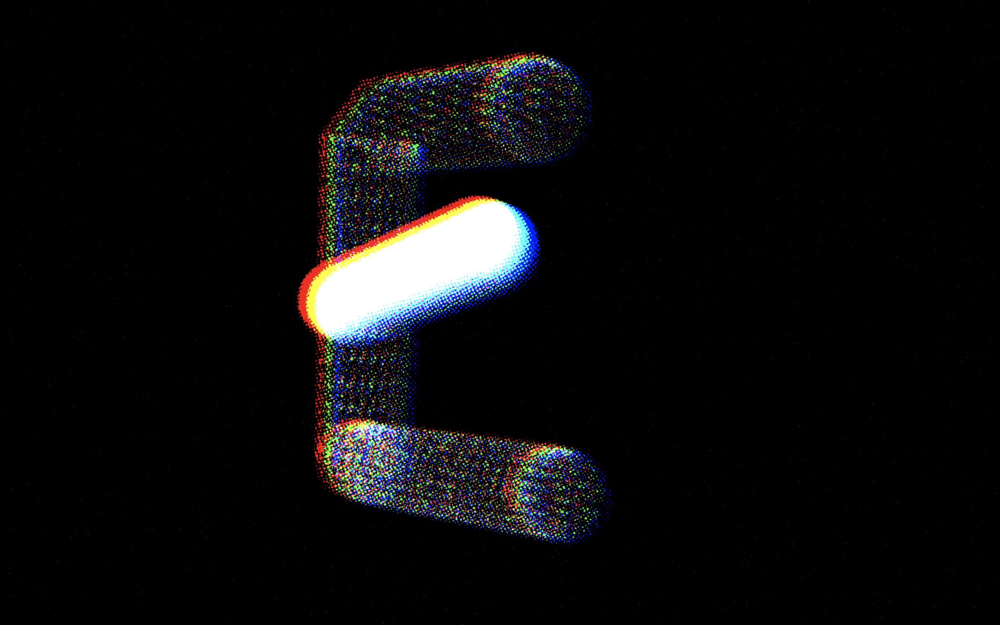
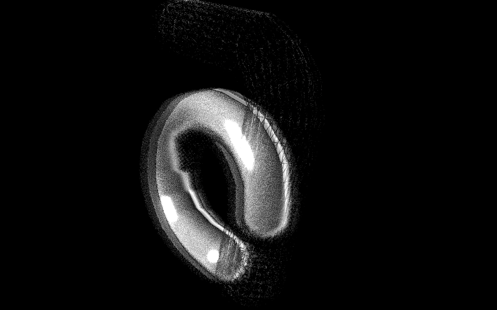
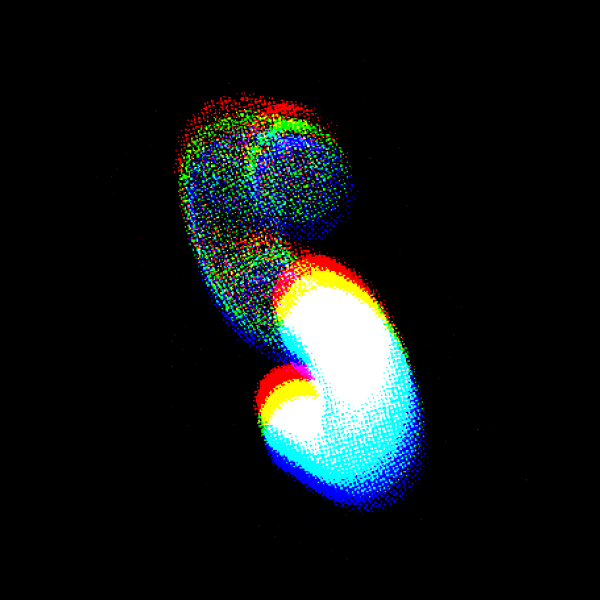
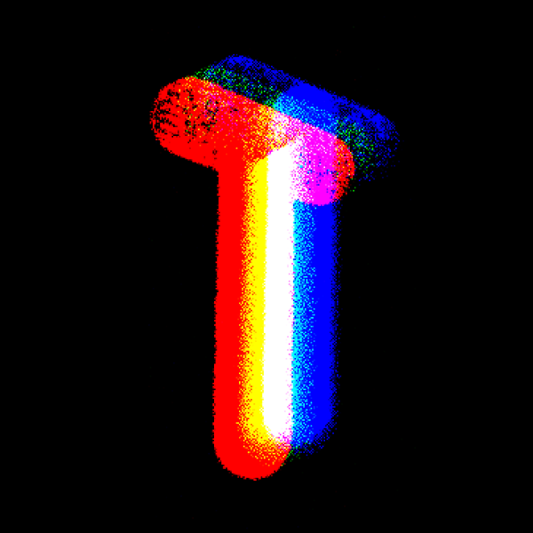
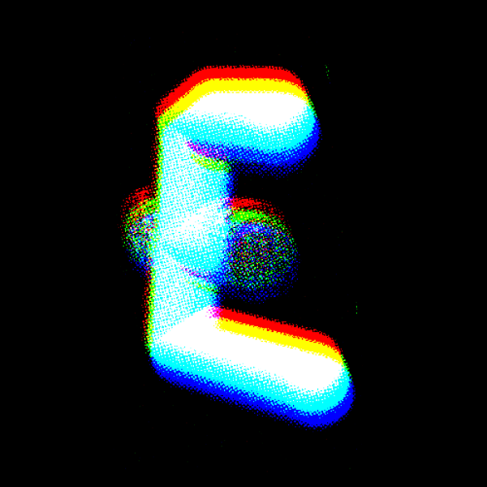
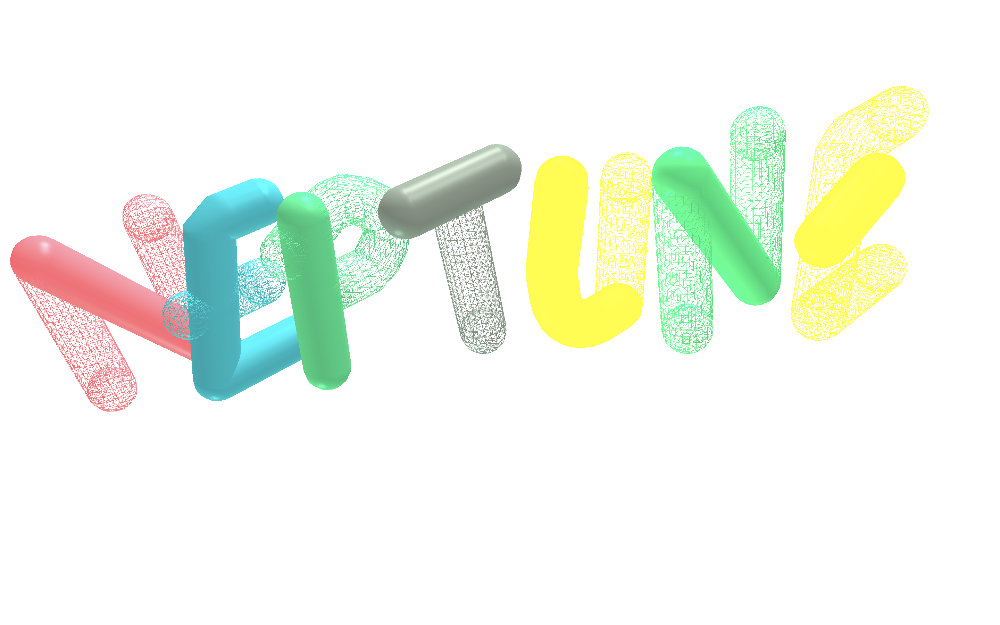

To further the design of <a href="https://yuinchien.com/alter/">Alter</a>, I explored type design in 3d space by creating geometry from the 2D letterforms, and experimented ways to decompose the visual elements such as color and texture using halftone & RGB shift.

<iframe src="https://player.vimeo.com/video/532999022?autoplay=1&loop=1&title=0&byline=0&portrait=0" style="position:absolute;top:0;left:0;width:100%;height:100%;" frameborder="0" allow="autoplay; fullscreen; picture-in-picture" allowfullscreen></iframe>

Checkout the web experiment made with three.js postprocessing effects: <a href="https://yuinchien.com/projects/alter/alphabet" target="_blank">yuinchien.com/projects/alter/alphabet</a>.

  
  

  
  

<!--  -->

<!--  -->

Type experiment before the visual effects: <a href="https://yuinchien.com/projects/alter/3d" target="_blank">yuinchien.com/projects/alter/3d</a>

<iframe src="https://player.vimeo.com/video/444407100?title=0&byline=0&portrait=0" style="position:absolute;top:0;left:0;width:100%;height:100%;" frameborder="0" allow="autoplay; fullscreen" allowfullscreen></iframe>

