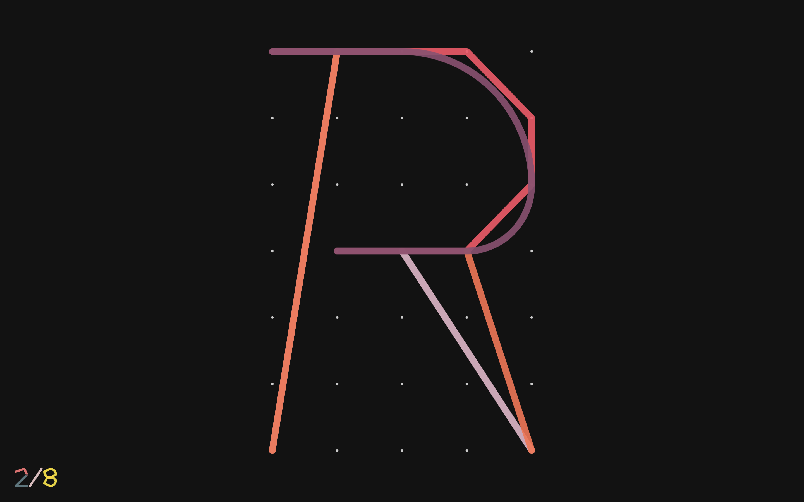
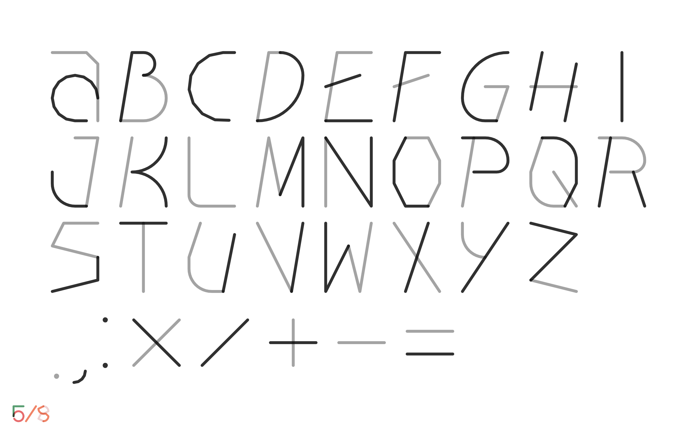

<iframe src="https://player.vimeo.com/video/420443568?autoplay=1&title=0&byline=0&portrait=0" style="position:absolute;top:0;left:0;width:100%;height:100%;" frameborder="0" allow="autoplay; fullscreen" allowfullscreen></iframe>

For my project Numerical Compositions, I have designed a set of single stroke duo-tone numericals to make typographic posters with the plotter. It felt obligatory to complete the alphabets, which lead to Alter. Because each character is live generated with code, I want to create an alternative typeface that feels forever changing and dynamic. The alternations incorporate colors and geometric constructs–curve/straight line, circle/polygon and vertical/oblique. Sometimes words feel strange with odd kernings, and different color combinations change the mood of how they read. Capricious, flawed and unpredictable just like humans.</a>

Checkout the type specimen: <a href="https://yuinchien.com/projects/alter/" target="_blank">yuinchien.com/projects/alter</a>.

<iframe src="https://player.vimeo.com/video/421173501?autoplay=1&title=0&byline=0&portrait=0" style="position:absolute;top:0;left:0;width:100%;height:100%;" frameborder="0" allow="autoplay; fullscreen" allowfullscreen></iframe>

<iframe src="https://player.vimeo.com/video/422485266?autoplay=1&loop=1&title=0&byline=0&portrait=0" style="position:absolute;top:0;left:0;width:100%;height:100%;" frameborder="0" allow="autoplay; fullscreen" allowfullscreen></iframe>

