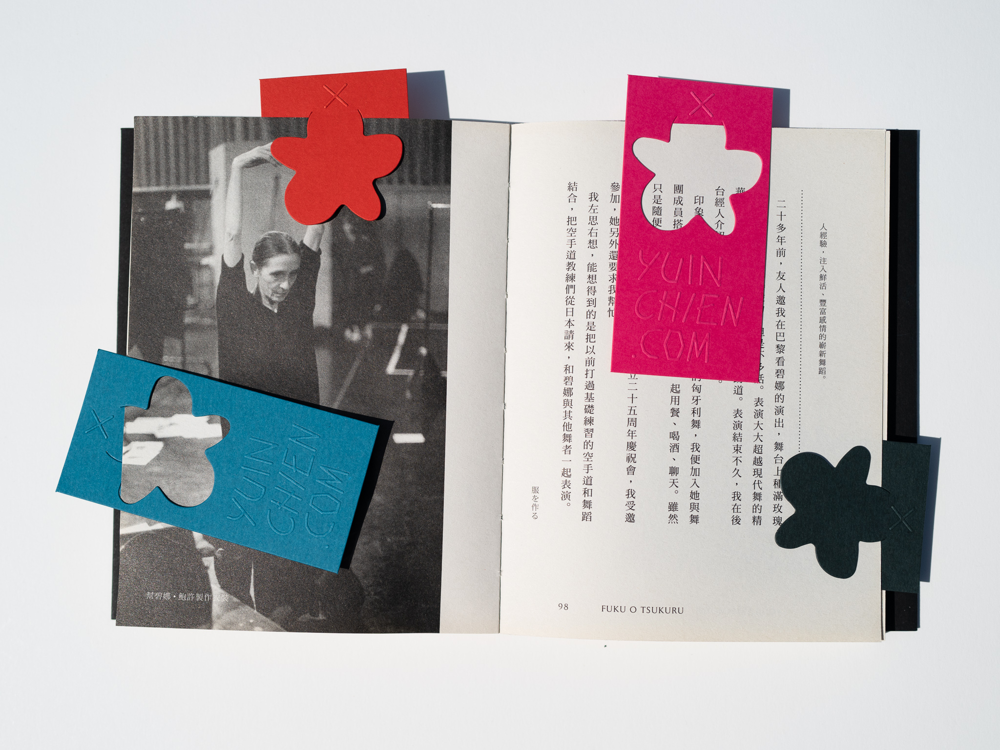
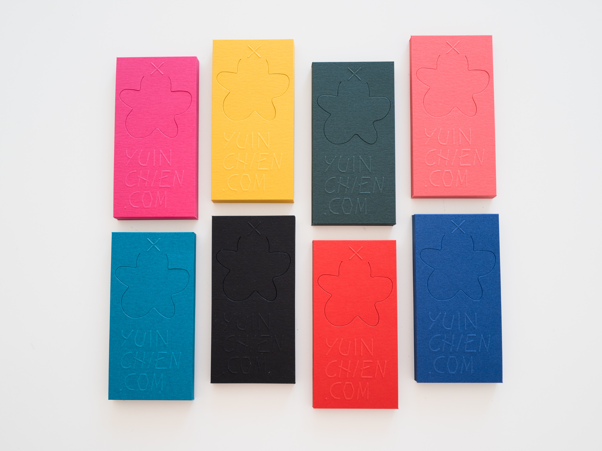
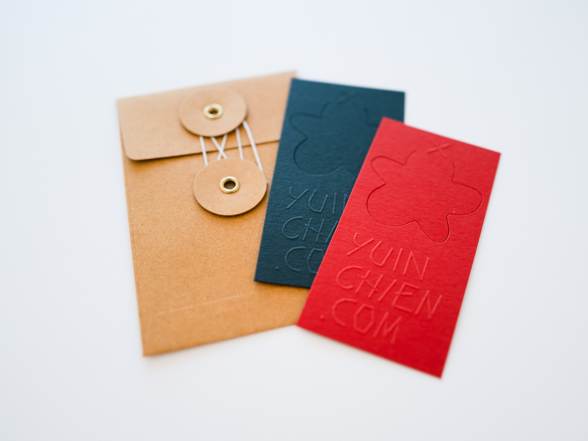

Letterpress bookmarks made with Mohawk color papers by <a href="https://theaestheticunion.com/" target="_blank">The Aesthetic Union</a>. Available in 4 sets of colors: Lipstick & Atoll, Indian Yellow & Deep Black, Coral & Royal Blue, Chili Pepper & Holly. 

The design was inspired by Taipei-based design studio <a href="https://odotoo.com/" target="_blank">O.OO</a>'s <a href="https://www.behance.net/gallery/81225763/ONE-DAY-PASS-LIMITED-EDITION-Ticket-Bookmark-design" href="_blank">bookmark project</a>, Traveler’s Company’s <a href="https://www.thejournalshop.com/midori-brass-number-clips?___store=default&refSrc=658&nosto=productpage-nosto-1-copy">brass clips</a> and Present & Correct's <a href="https://www.presentandcorrect.com/collections/organise/products/clip-strip" target="_blank">paper clips</a>.

<!--  -->

<!--  -->

<!--  -->

<!--  -->

They are packaged in an origami envelope made with stardust paper. Thanks to origami <a href="https://www.youtube.com/watch?v=oGx6yjAyTzo" target="_blank">tutorial</a> by <a href="https://www.youtube.com/channel/UCsjyZN9CL9lyt4vFHfXypSQ" target="_blank">happypuppytruffles</a>.

<iframe src="https://player.vimeo.com/video/446626071?autoplay=1&loop=1&title=0&byline=0&portrait=0" style="position:absolute;top:0;left:0;width:100%;height:100%;" frameborder="0" allow="autoplay; fullscreen" allowfullscreen></iframe>

