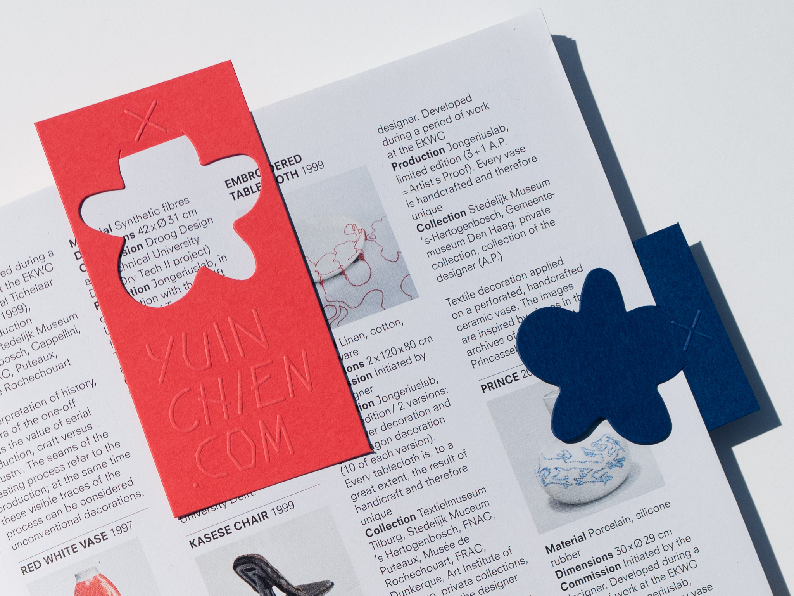
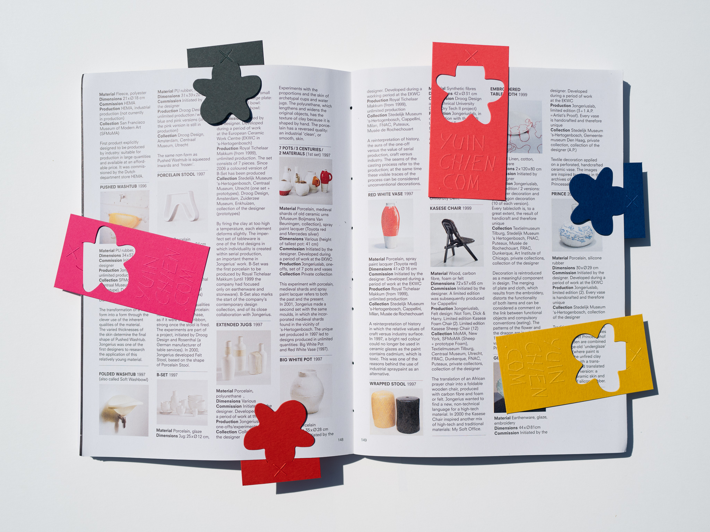
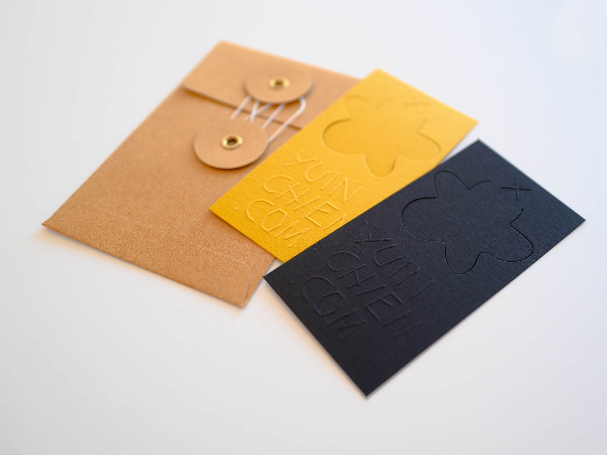
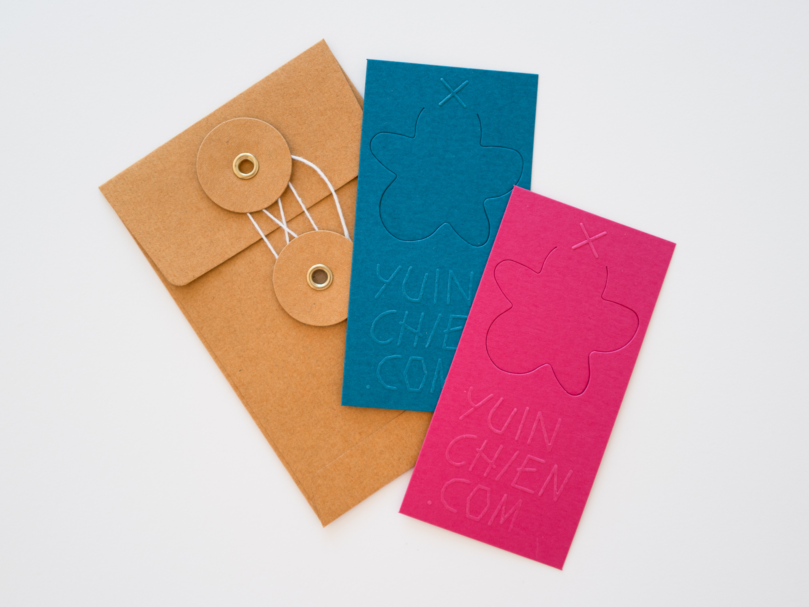
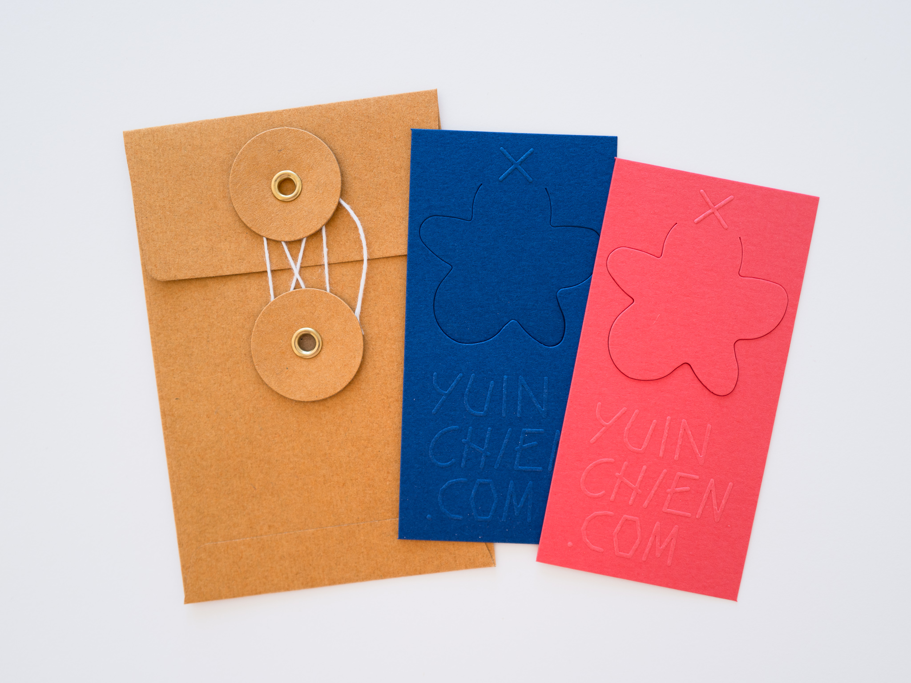

The idea of making letterpress business cards came up when I found out the local print shop <a href="https://theaestheticunion.com/" target="_blank">The Aesthetic Union</a> was reopened for business in July, after the March shelter in place order in San Francisco. My spirit was recently lifted from the quarantine misery because of books, I thought instead of making plain business cards, the additional function of bookmark could inspire people to read. It was my first letterpress project and I learned so much from working with The Aesthetic Union. The original concept of printing different colors(pink & yellow) on both sides was too costly, we also considered gluing two color papers together but the thickness could hurt the books. I was directed to <a href="https://www.mohawkconnects.com/products/paper/keaykolour" target="_blank">Mohawk keaykolour</a>, the idea of printing the same design on wide range of color papers seemed to be a good solution. I love the tactile experience of letterpress, and wanted the texture to be present for both opened & closed books. I decided to go with a blind emboss for crisp & subtle graphics on both sides. The cut mark was from my <a href="/superellipse/">Superellipse</a> design study, and the text was set in my typeface <a href="/alter/">Alter</a>.

The design & photography were inspired by design studio <a href="https://odotoo.com/" target="_blank">O.OO</a>'s <a href="https://www.behance.net/gallery/81225763/ONE-DAY-PASS-LIMITED-EDITION-Ticket-Bookmark-design" href="_blank">Bookmark project</a>, Traveler’s Company’s <a href="https://www.thejournalshop.com/midori-brass-number-clips?___store=default&refSrc=658&nosto=productpage-nosto-1-copy" href="_blank">Brass Clips</a> and Present & Correct's <a href="https://www.presentandcorrect.com/collections/organise/products/clip-strip" target="_blank">Clip Strip</a> and <a href="https://www.presentandcorrect.com/collections/clips-pins/products/brass-numbered-clips" target="_blank">Brass Numbered Clips</a>.

Printed in 4 sets of colors: Lipstick & Atoll, Indian Yellow & Deep Black, Coral & Royal Blue, Chili Pepper & Holly.

  
  

  
  

They are packaged in an origami envelope made with stardust paper. Thanks to origami <a href="https://www.youtube.com/watch?v=oGx6yjAyTzo" target="_blank">tutorial</a> by <a href="https://www.youtube.com/channel/UCsjyZN9CL9lyt4vFHfXypSQ" target="_blank">happypuppytruffles</a>.

<iframe src="https://player.vimeo.com/video/446626071?autoplay=1&loop=1&title=0&byline=0&portrait=0" style="position:absolute;top:0;left:0;width:100%;height:100%;" frameborder="0" allow="autoplay; fullscreen" allowfullscreen></iframe>

