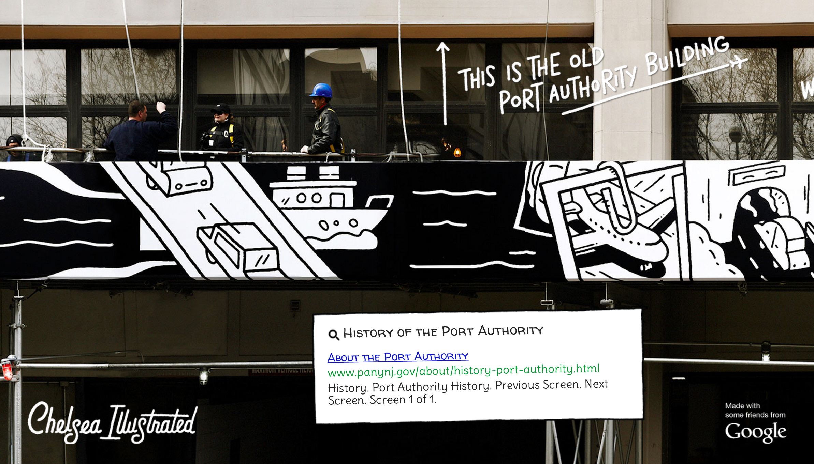

The mural tells the story of Chelsea's past and present. It was exhibited on the facade of the Google NY building in 2012, and exists online using Google technology to reveal the search behind the history. The project was a collaboration between Dark Igloo and Google Creative Lab.

