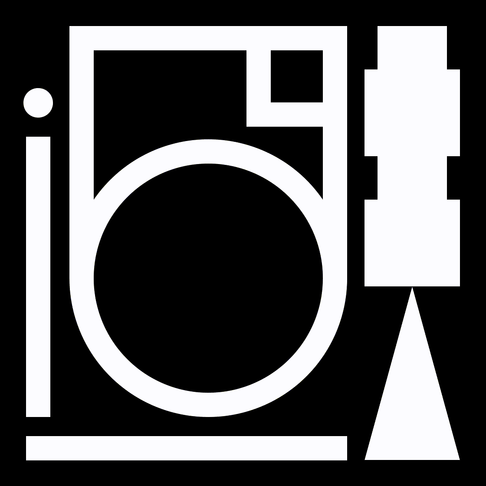
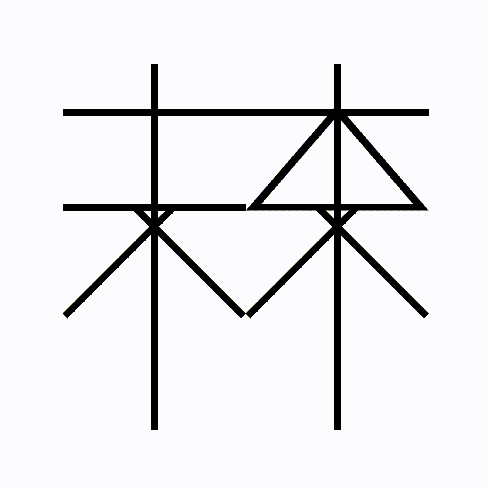
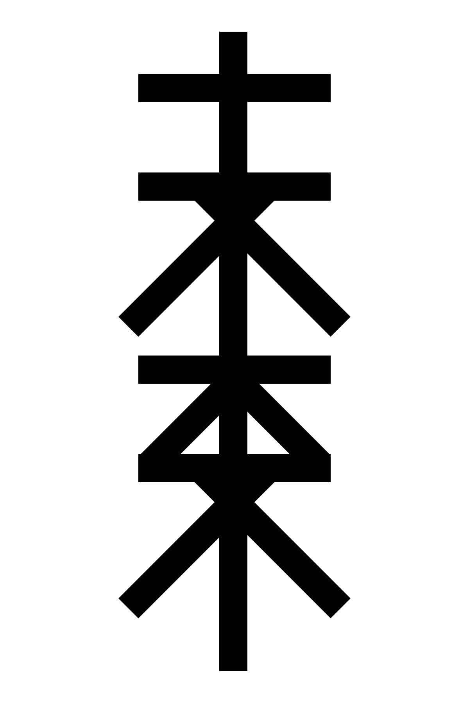
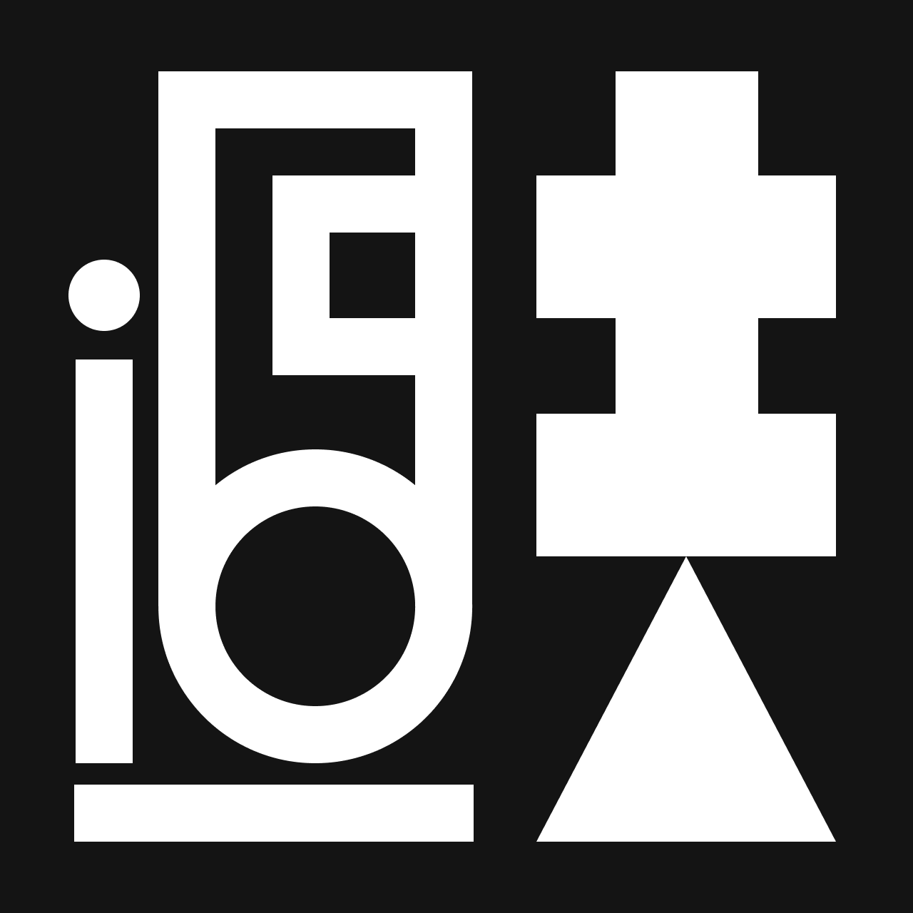
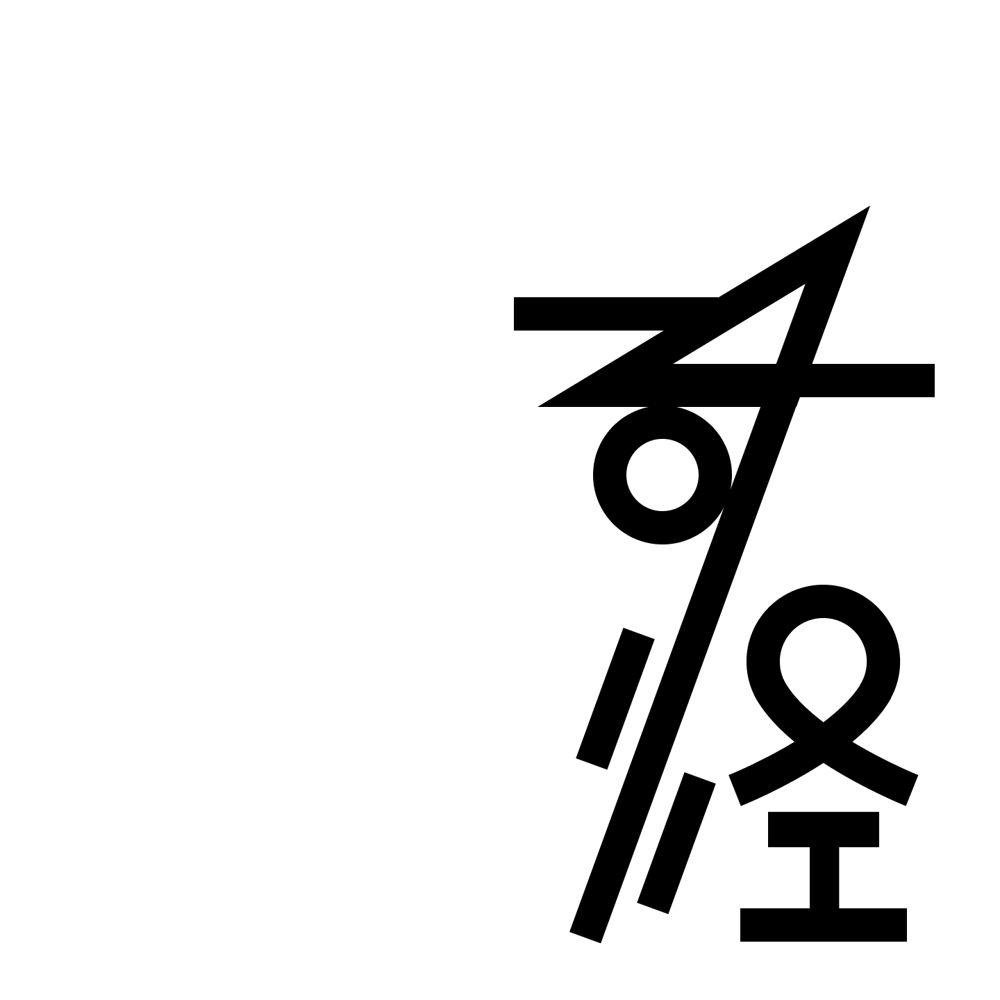
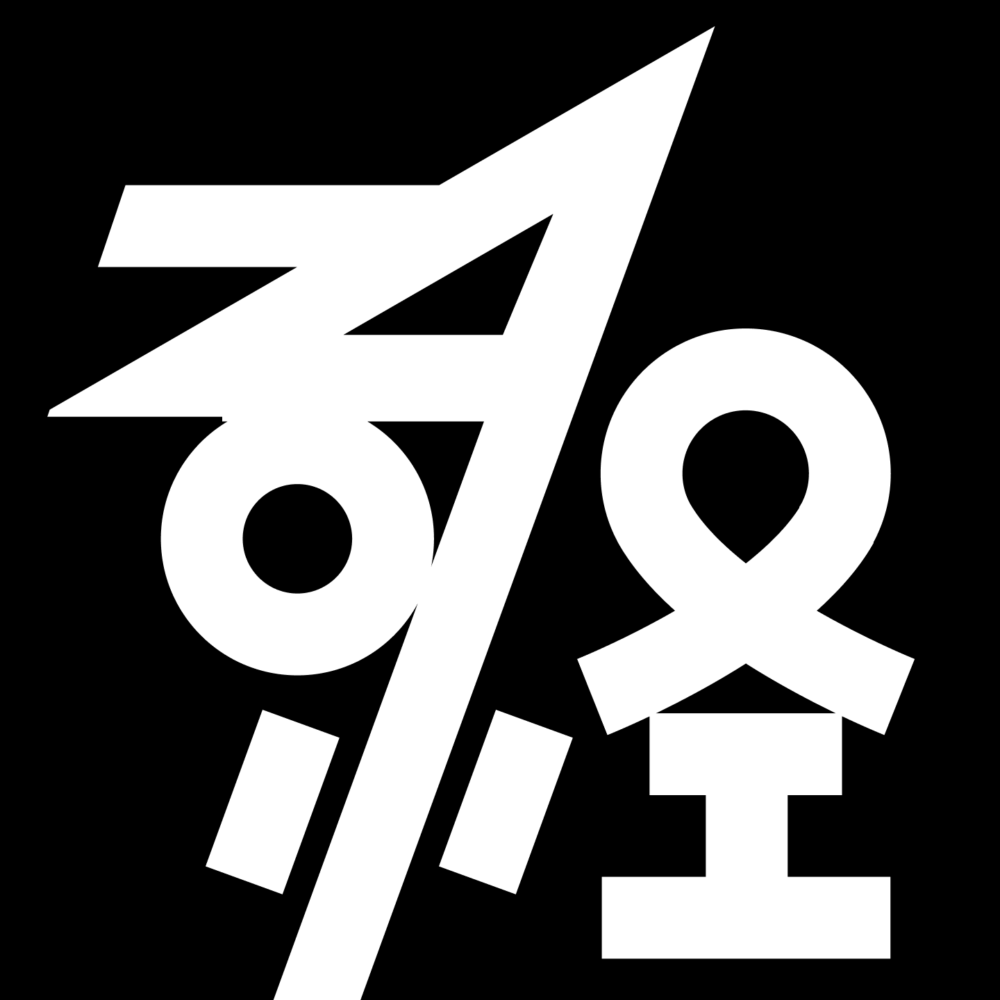
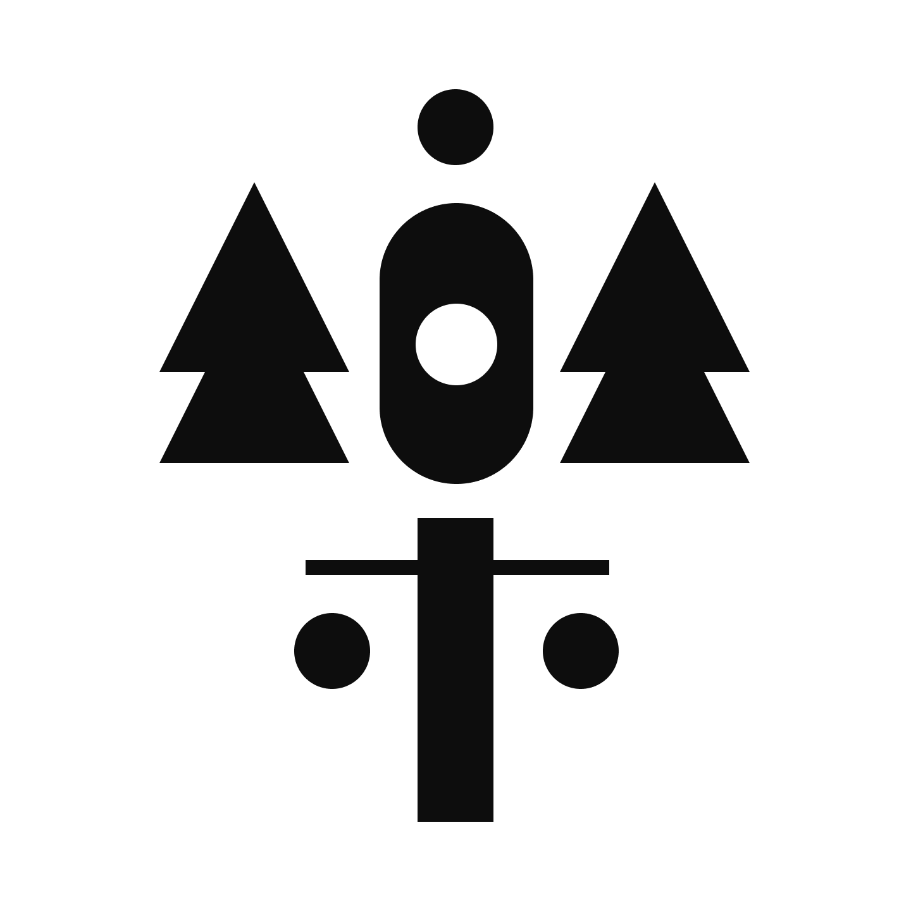
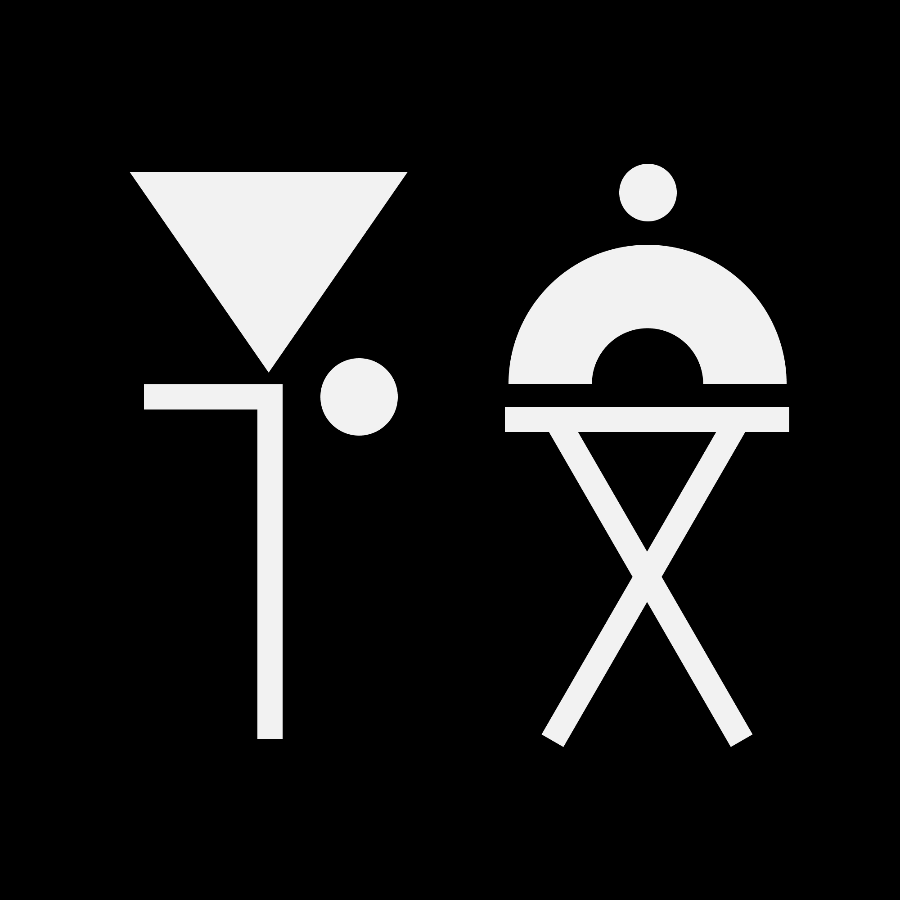

I forgot how to write in Chinese because typing doesn't require memorizing the characters in detail. This is a series  of type design exercise in Chinese to reconnect with my native language. I want to explore typographic expressions with geometry and motion, and push the boundary of abstraction.

  

  

  

  

  

  

  

  

  

  

  

