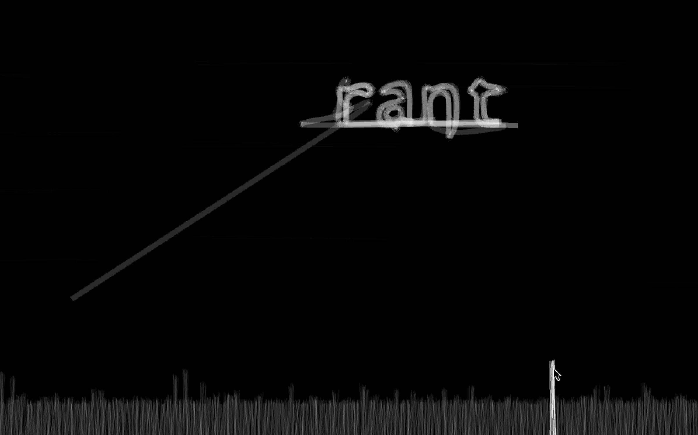
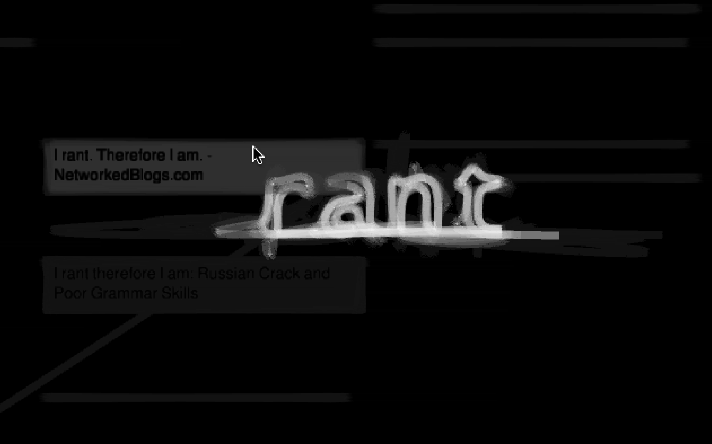

<iframe src="https://player.vimeo.com/video/8070070?autoplay=1&loop=1&title=0&byline=0&portrait=0" style="position:absolute;top:0;left:0;width:100%;height:100%;" frameborder="0" allow="autoplay; fullscreen" allowfullscreen></iframe>

Research of Physical Interaction has been investigating how to bring computation out of the screen because tangibility plays such an important role in our lives. I began to be curious about what do people feel about virtual versus reality, what makes people feel distanced or existence? The objective of this project is to make inquiry of what people commented online with the sentence of "I _ therefore I exist". The system does data-mining with data sent from google search (articles/blogs/news etc) to process results and create visualization of dynamic typography and graphics. Project built with Processing, Python, xgoogle & MySQL.

