
Inspired by Matisse cut out, I wanted to create the free forms made out of paper & scissor. I started using Paper.js to create a tree-like structure, and turned it into a drawing tool that can generate dynamic outlines for the skeleton. 

<iframe src="https://player.vimeo.com/video/358426372?autoplay=1&loop=1&title=0&byline=0&portrait=0" style="position:absolute;top:0;left:0;width:100%;height:100%;" frameborder="0" allow="autoplay; fullscreen" allowfullscreen></iframe>

<iframe src="https://player.vimeo.com/video/358414087?autoplay=1&loop=1&title=0&byline=0&portrait=0" style="position:absolute;top:0;left:0;width:100%;height:100%;" frameborder="0" allow="autoplay; fullscreen" allowfullscreen></iframe>

The left video demonstrates how the tool works with the most basic structure – 3 nodes. Later on I expaned the tool to create animation like the video at the right, by interpolating still frames that I composed. Below are the drawings created with the drawing tool. 

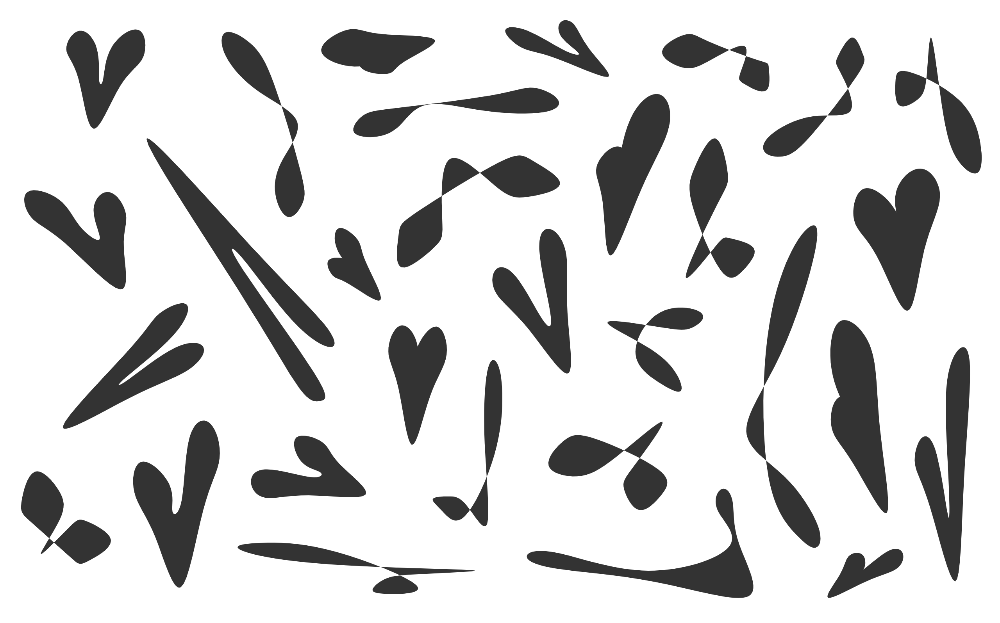

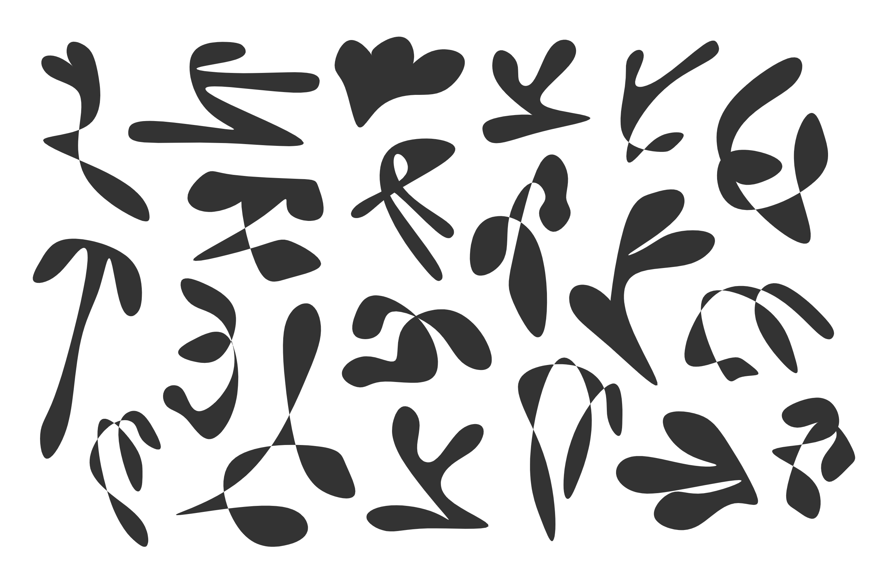

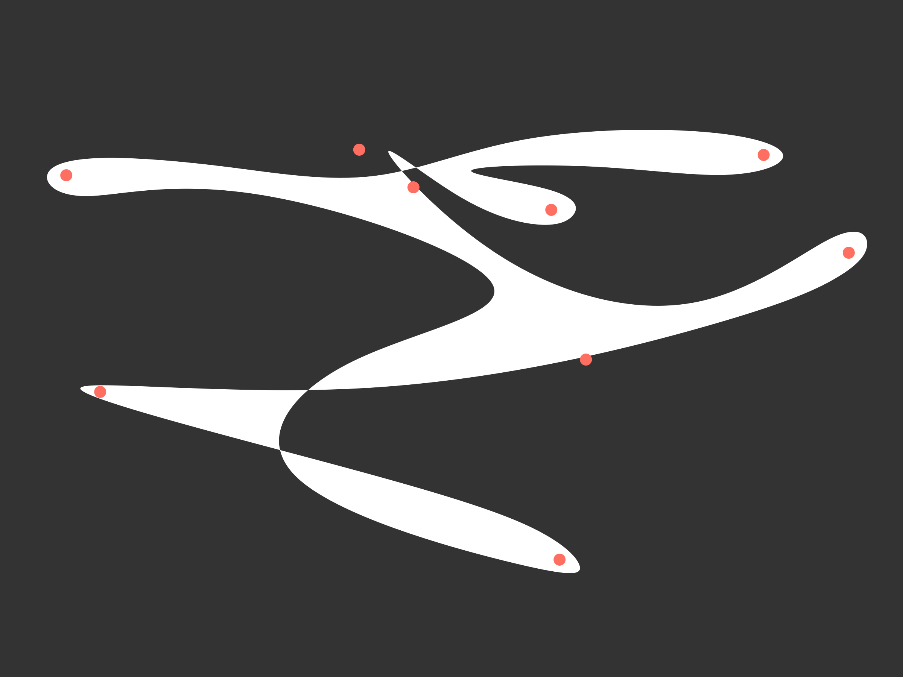

  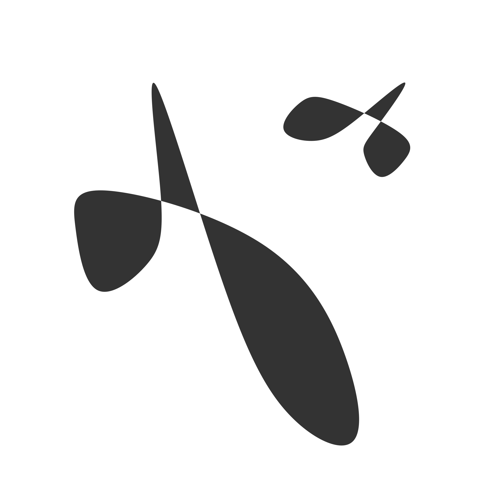
  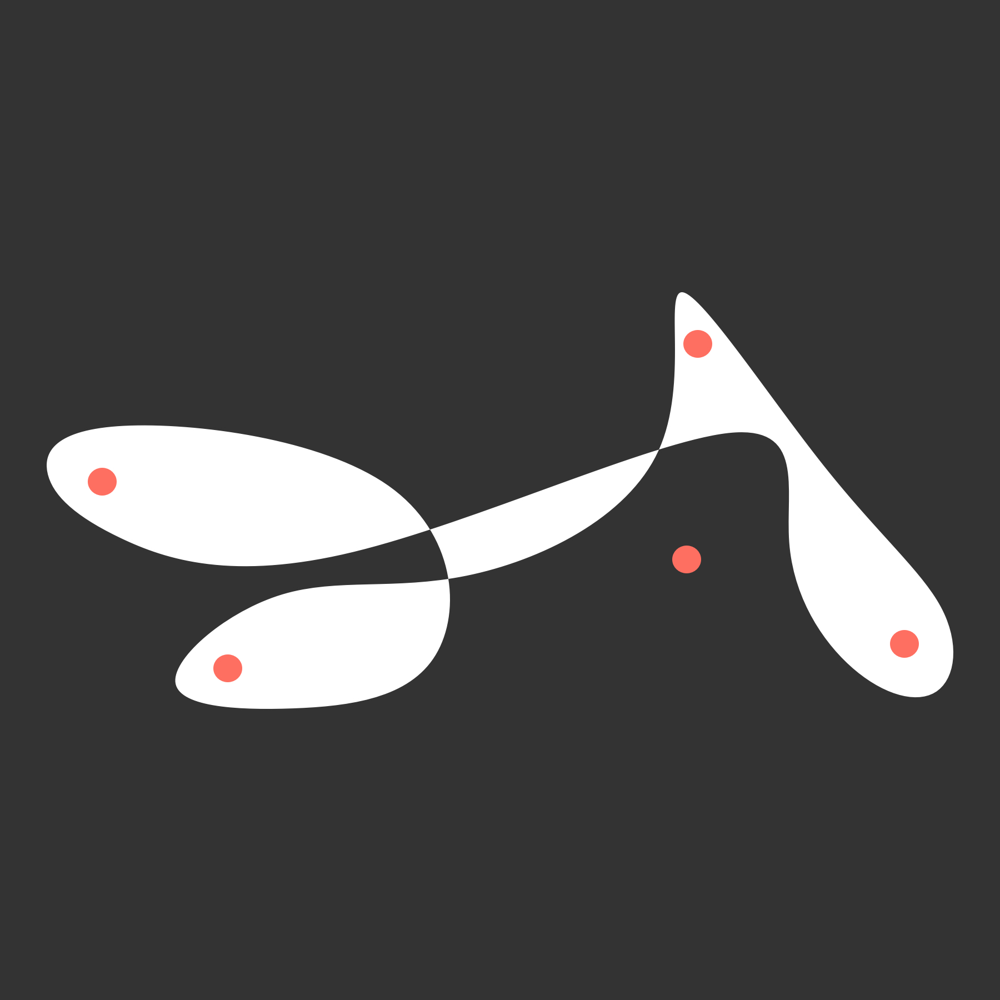

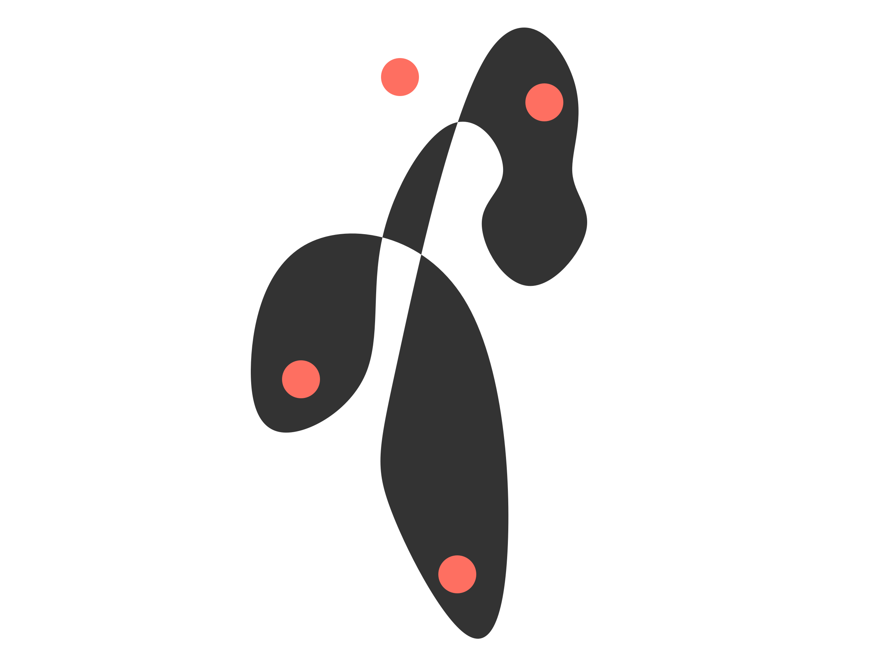

  
  

<iframe src="https://player.vimeo.com/video/358202627?autoplay=1&loop=1&title=0&byline=0&portrait=0" style="position:absolute;top:0;left:0;width:100%;height:100%;" frameborder="0" allow="autoplay; fullscreen" allowfullscreen></iframe>

<iframe src="https://player.vimeo.com/video/358235316?autoplay=1&loop=1&title=0&byline=0&portrait=0" style="position:absolute;top:0;left:0;width:100%;height:100%;" frameborder="0" allow="autoplay; fullscreen" allowfullscreen></iframe>

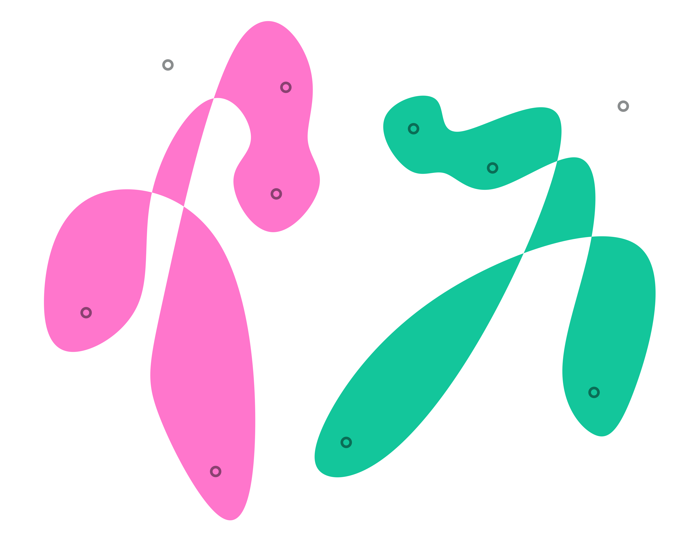

  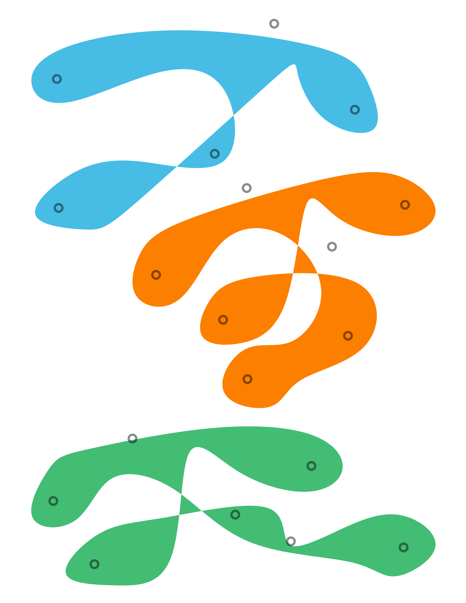
  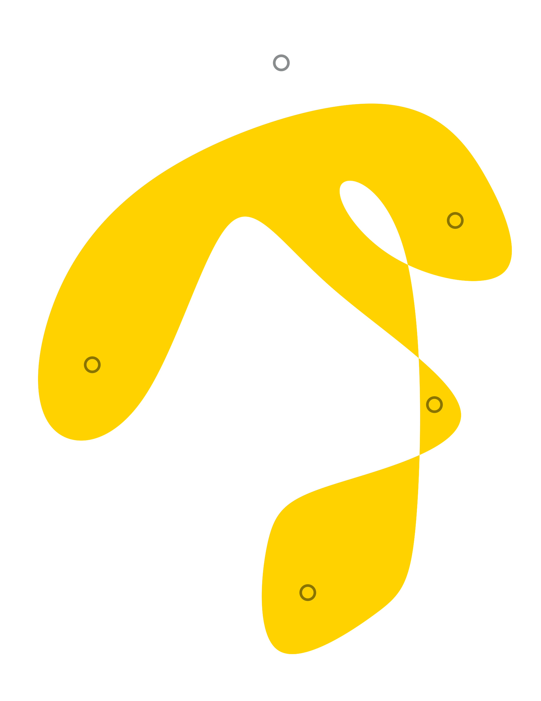

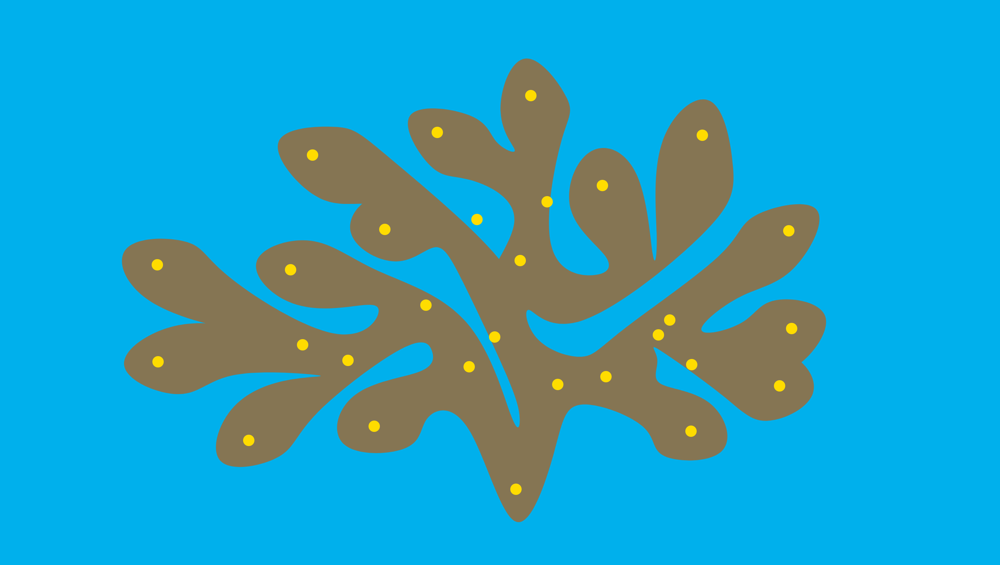

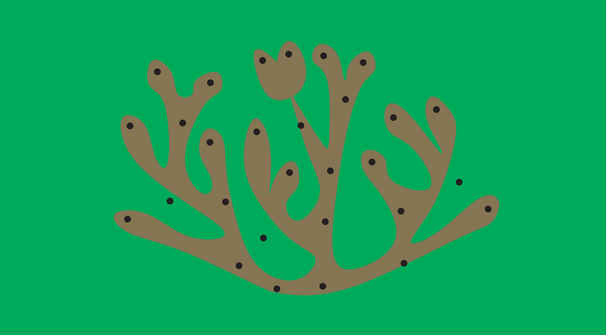
