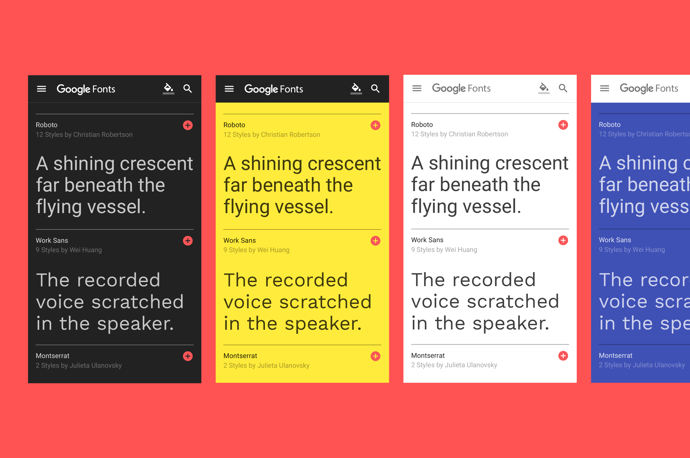
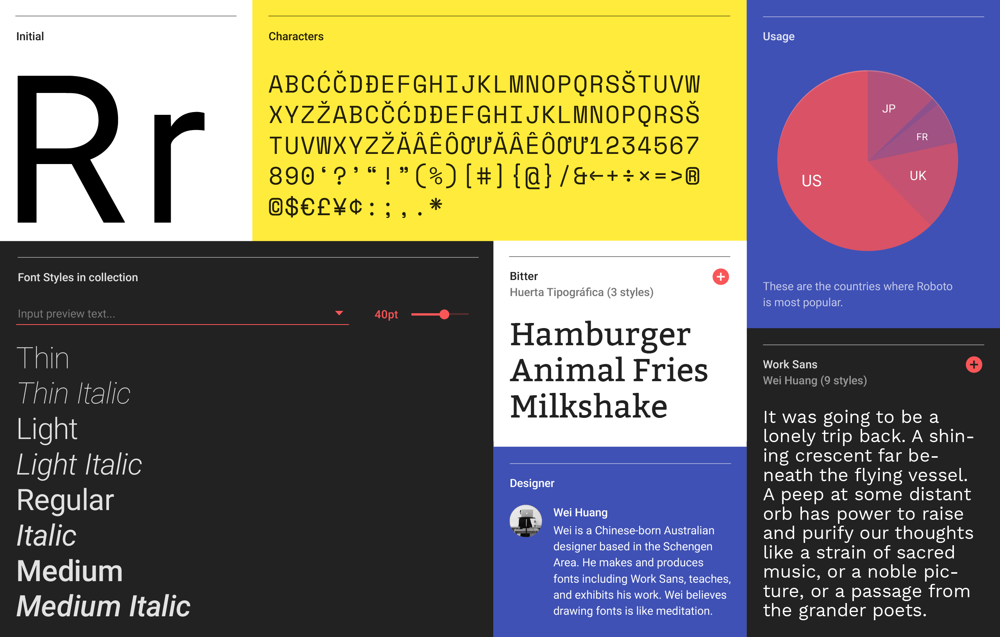
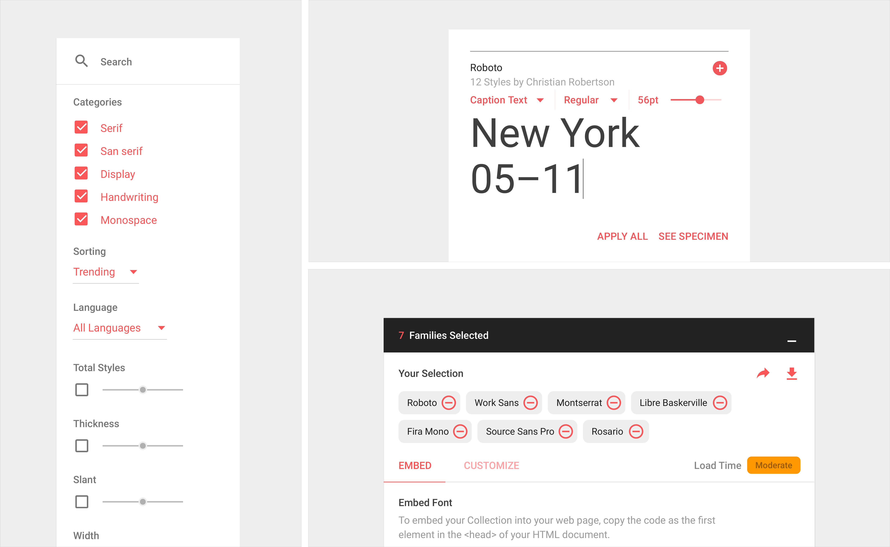
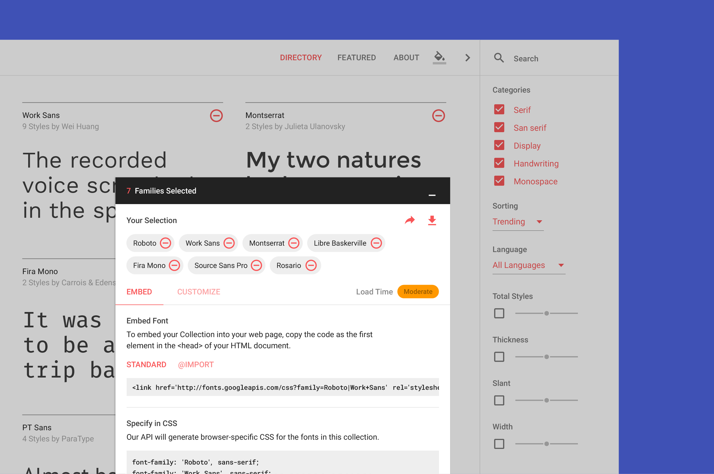
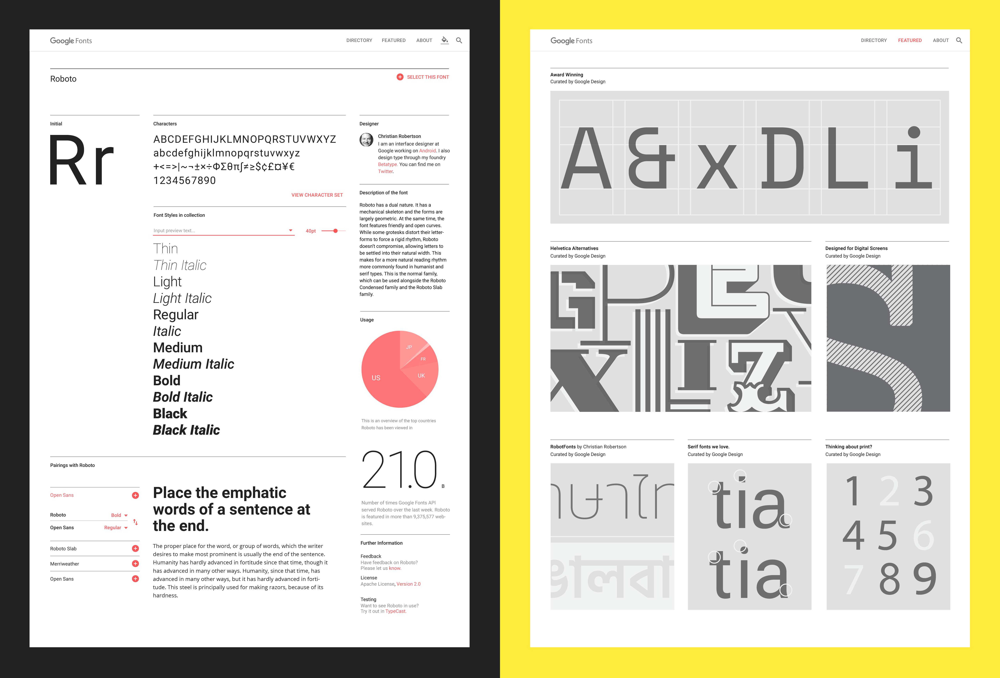
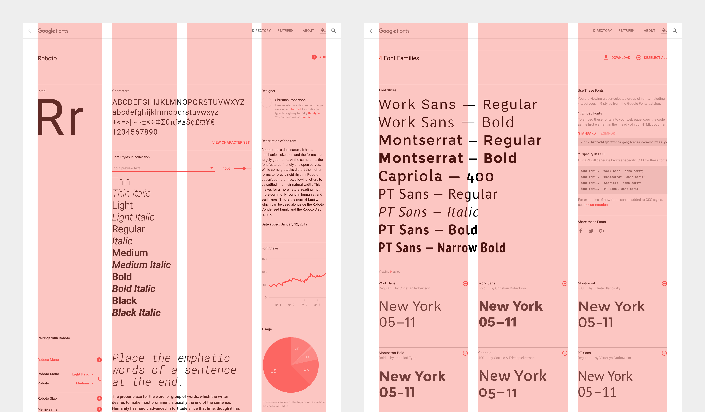
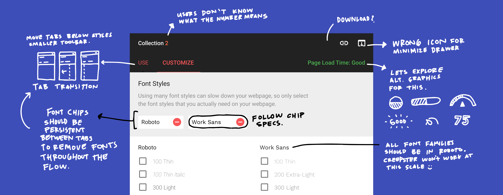
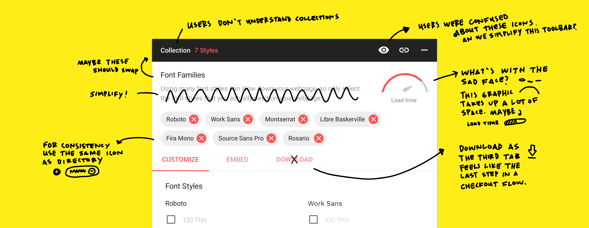
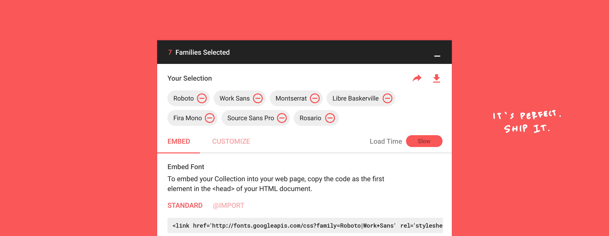

First launched in 2010 as an engineering initiative to move the web forward, today Google fonts are viewed on the web over 15 billion times a day in over 135 languages worldwide. As the design lead, I worked on the 2016 Google Fonts redesign to best showcase typography and type designers while making fonts easy to explore and use.

The redesign has been selected by the 2016 STA 100 <a href="https://100.sta-chicago.org/winners/2016/google-fonts" target="_blank">Awards</a>, the 2017 Communication Arts Interactive Annual <a href="https://www.commarts.com/project/24654/google-fonts-redesign" target="_blank">Awards</a> and the 2017 Communication Arts Typography Annual <a href="https://www.commarts.com/project/24576/google-fonts-website-redesign" target="_blank">Awards</a>. To learn more about the redesign, please checkout the article – <a href="https://design.google/library/reimagining-google-fonts/" target="_blank">Reimagining Google Fonts</a> on Google Design and visit <a href="https://fonts.google.com/" target="_blank">fonts.google.com</a>. Selected press:

* [The new Google Fonts database is a design geek's paradise](https://www.theverge.com/2016/6/15/11950320/ google-fonts-website-redesign-2016) – The Verge
* [The new Google Fonts is a win for designers](https://99designs.com/blog/trends/new-google-fonts/) – 99designs
* [Google Fonts website gets a major redesign](http://www.creativebloq.com/fonts/google-fonts-website-gets-redesign-61620894) – Creative Bloq

