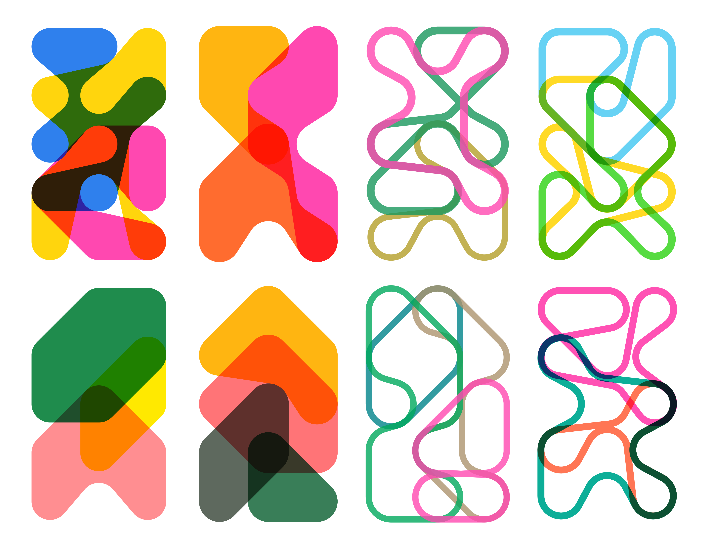

Inspired by the research in Armin Hofmann's <a target="_blank" href="https://www.typogabor.com/armin-hofmann/pages/11-armin-hofmann.html">Graphic Design Manual</a>, I began my own grid study of <a href="https://en.wikipedia.org/wiki/Dubins_path" target="_blank">Dubins path</a>. The drawing device is made of a grid of circles and records the wandering paths inside the grid to create shapes. Each journey is a closed loop composed of tangents and arcs, and never visit a circle more than once. The demo below shows variants of circle size, stroke width and outline/filled mode.

<iframe src="https://player.vimeo.com/video/406053326?title=0&byline=0&portrait=0" style="position:absolute;top:0;left:0;width:100%;height:100%;" frameborder="0" allow="autoplay; fullscreen" allowfullscreen></iframe>

With the initial drawing device setup, I started exploring compositions, densities, shades and dimension by layering the paths in interesting ways.

  
  

After the more complex grid exploration, I was drawn to the individual fluid shape created with smaller grid. They feel like different characters each has its own gesture and disposition. Below are collections of shapes made with different circle sizes.

  
  

I developed a series of sketches by playing with colors and the 3x5 grid system. Printing them in Risograph seemed like a good idea, I tried to explore riso color, texture and gradient.

<iframe src="https://player.vimeo.com/video/408884474?autoplay=1&loop=1&title=0&byline=0&portrait=0&muted=1" style="position:absolute;top:0;left:0;width:100%;height:100%;" frameborder="0" allow="autoplay; fullscreen" allowfullscreen></iframe>

<iframe src="https://player.vimeo.com/video/408884448?autoplay=1&loop=1&title=0&byline=0&portrait=0&muted=1" style="position:absolute;top:0;left:0;width:100%;height:100%;" frameborder="0" allow="autoplay; fullscreen" allowfullscreen></iframe>

  
  

The grid study also lead to the creation of  <a href="/max">MAX</a> – an experimental typeface.

