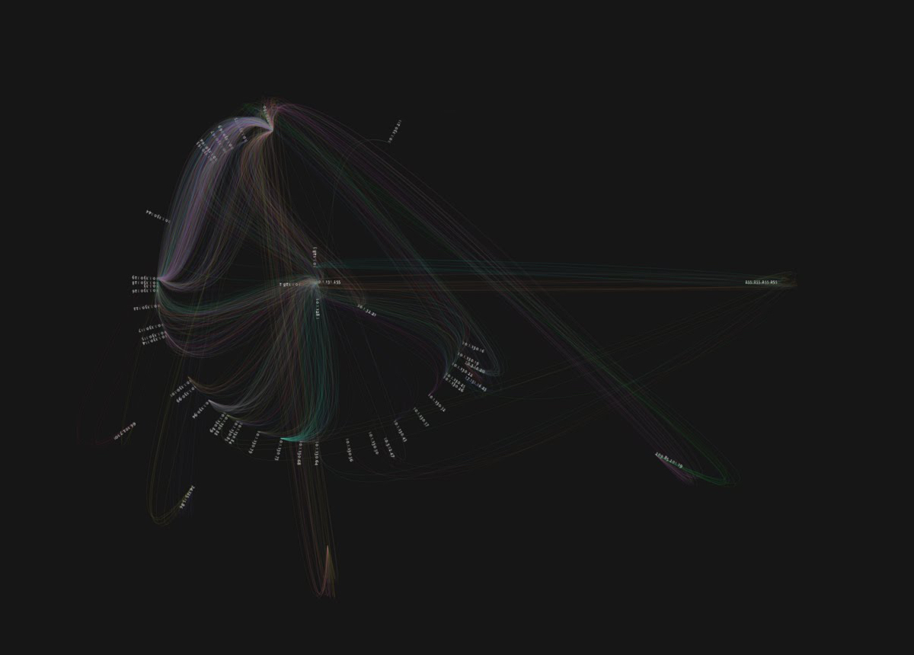
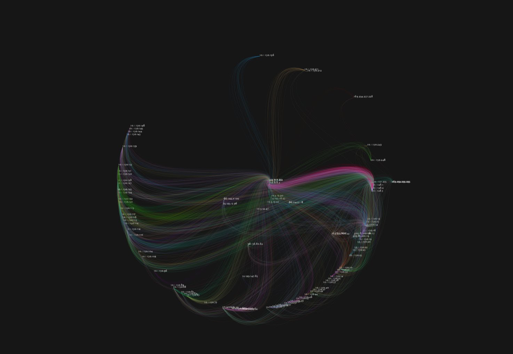
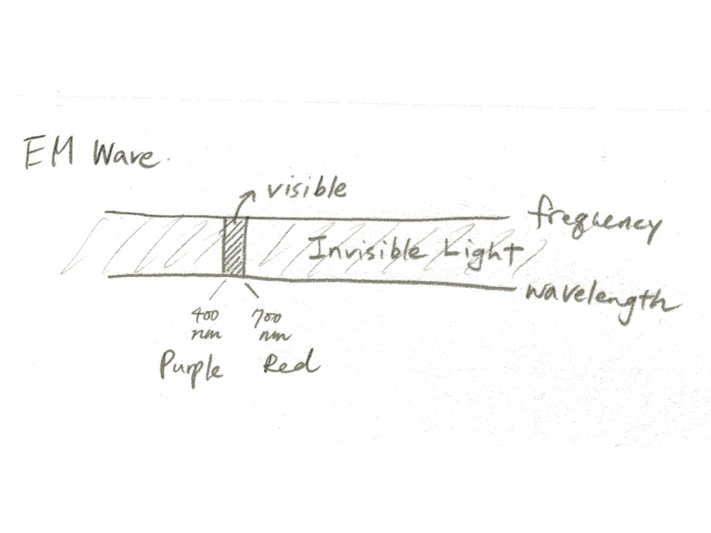
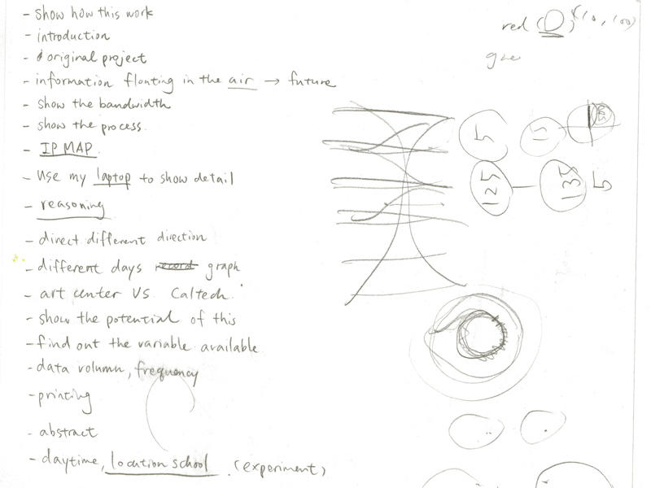
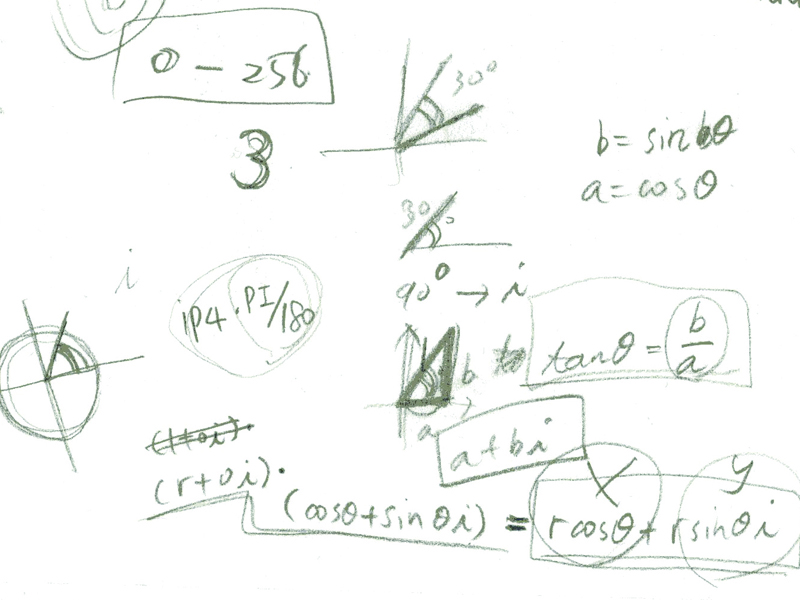
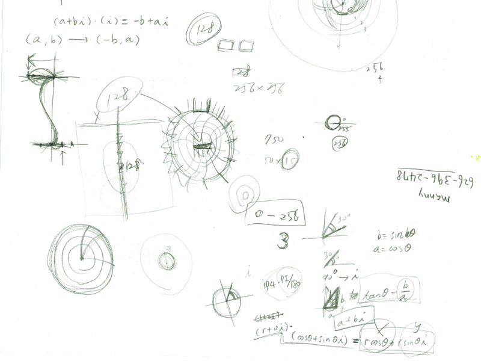

Human eyes can only perceive a small range of electromagnetic waves - the visible light, while others remain invisible to us. This project is to visualize the invisible light in the air - the wireless network traffic. Built with Processing & Carnivore.

  
  

  
  

