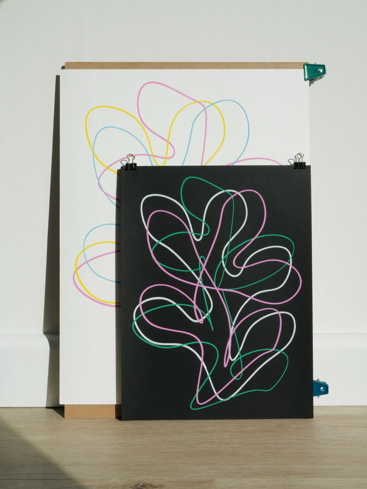

A series of leaf drawings designed using a vector tool I created with Paper.js. The posters are made with a pen plotter, with ink pens or acrylic pen markers of a variety of stroke widths. Checkout my <a href="http://store.yuinchien.com" href="_blank">online shop</a> if you are interested in ordering a poster.

  
  

  
  

  
  

  
  

  
  

  
  

  
  

  
  

