
A center piece of Google Chrome's developer tools, <a href="https://developers.google.com/web/tools/lighthouse" target="_blank">Lighthouse</a> analyzes web apps and web pages, collecting modern performance metrics and insights on developer best practices. I lead the visual design refresh, and UX design for Lighthouse & Lighthouse CI in 2019.

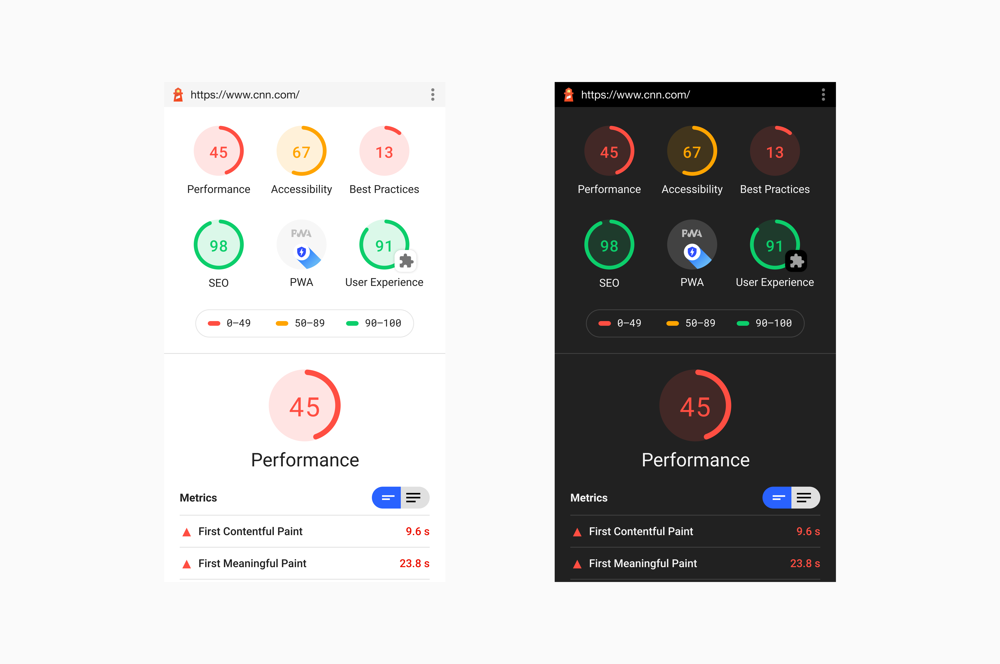

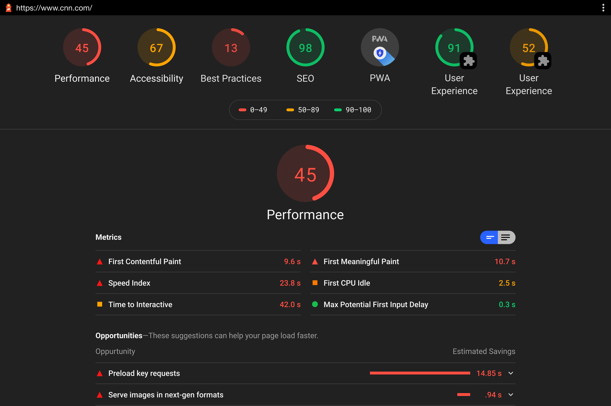

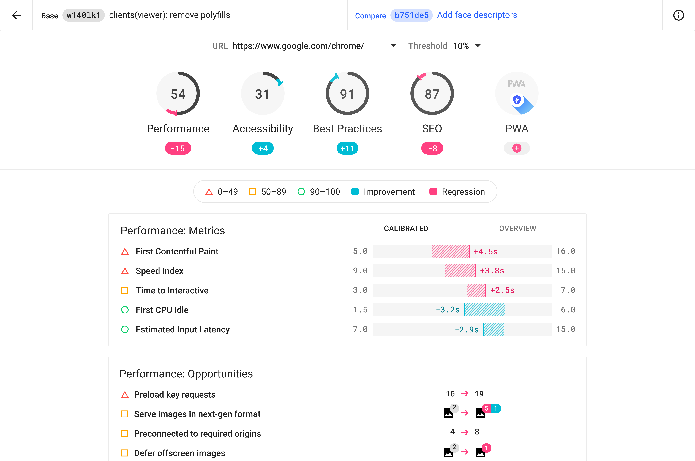

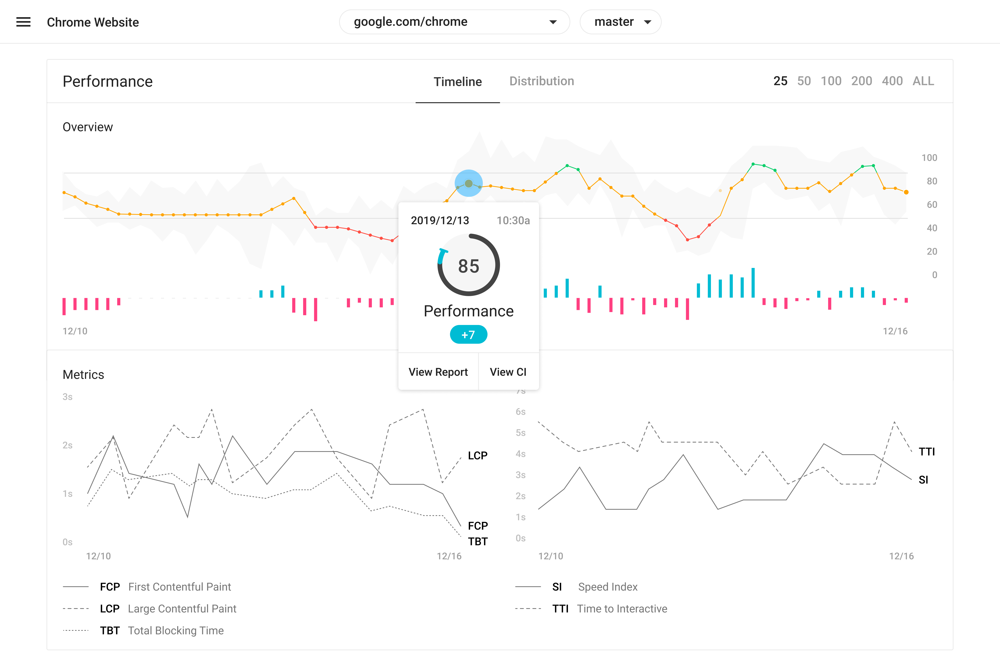

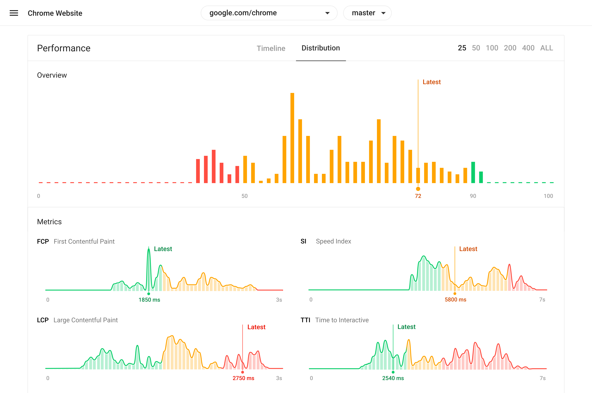

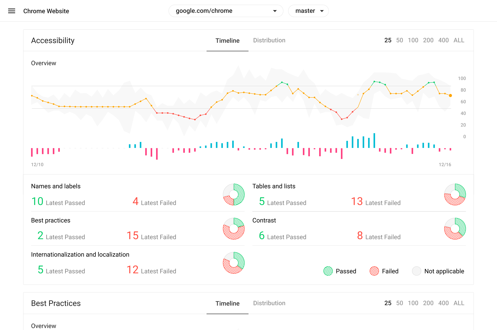

I've also created motion graphics in html and css. The first one is an animated SVG for loading state, morphing between the shapes and colors associated with levels of performances: excellent(green/circle), good(orange/square) and poor(red/triangle). The other explores the dynamics of score change in Lighthouse CI.

  <iframe
    src="https://glitch.com/embed/#!/embed/lh-loader?path=index.html&previewSize=100&attributionHidden=true&sidebarCollapsed=true"
    title="lh-loader on Glitch"
    allow="geolocation; microphone; camera; midi; vr; encrypted-media"
    style="height: 100%; width: 100%; border: 0;">
  </iframe>

  <iframe
    src="https://glitch.com/embed/#!/embed/ci-graph?path=style.css&previewSize=100&attributionHidden=true&sidebarCollapsed=true"
    title="ci-graph on Glitch"
    allow="geolocation; microphone; camera; midi; vr; encrypted-media"
    style="height: 100%; width: 100%; border: 0;">
  </iframe>

<!-- 

  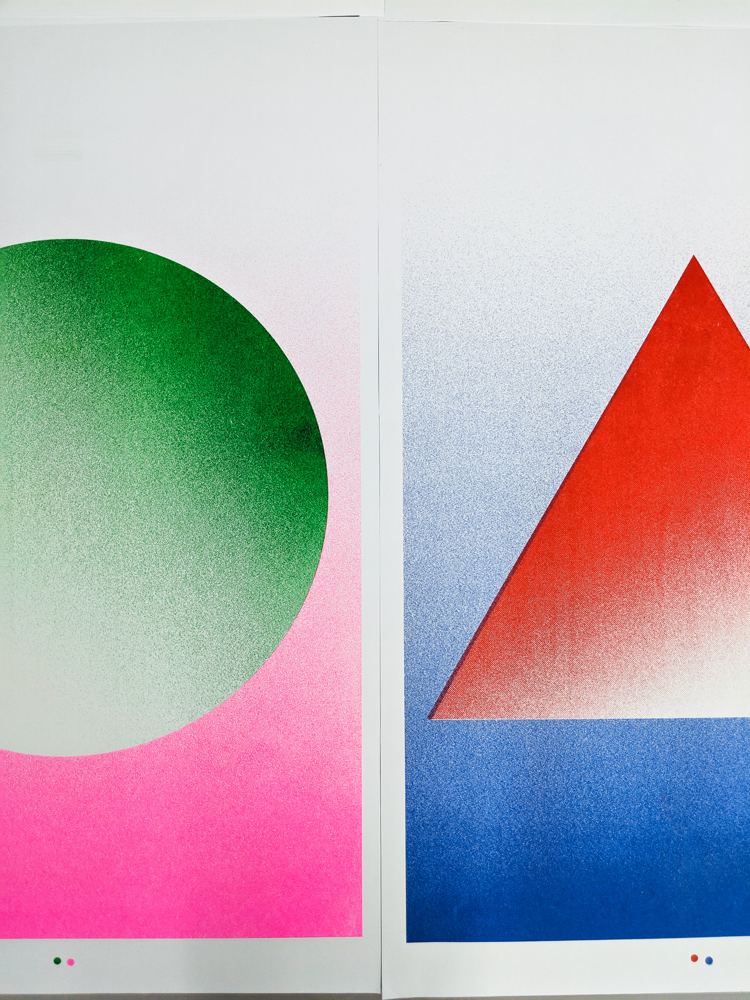
  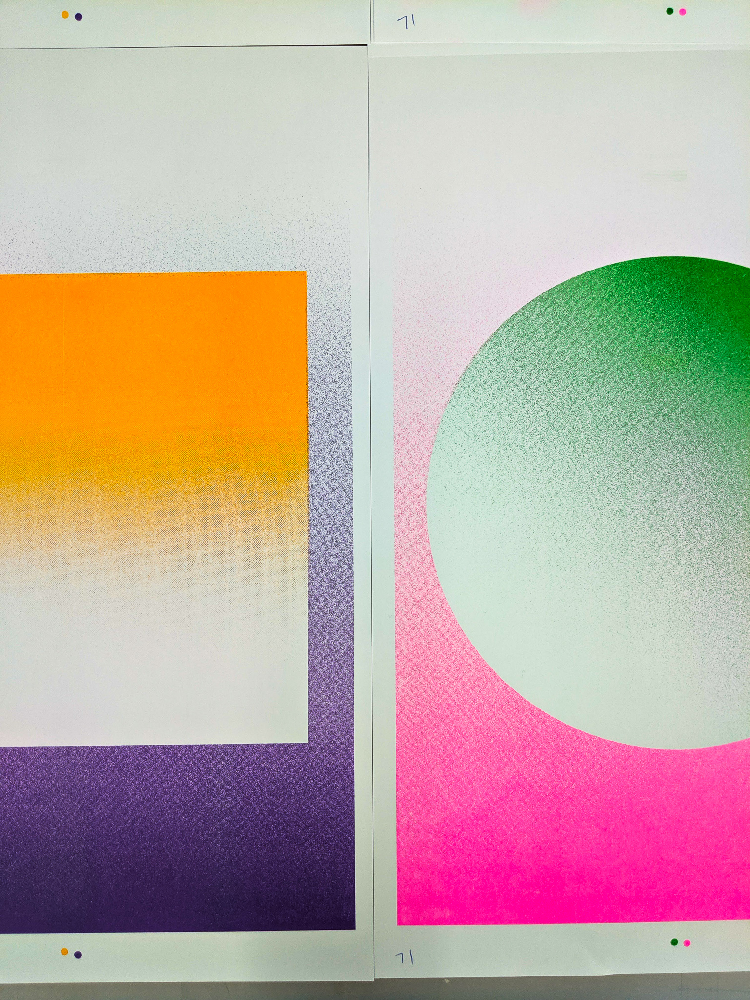

 -->

To promote Lighthouse at the <a href="https://developer.chrome.com/devsummit/" target="_blank">Chrome Developer Summit</a> in 2019, I designed a series of Risograph posters featuring the brand colors and graphics for display and take-away.

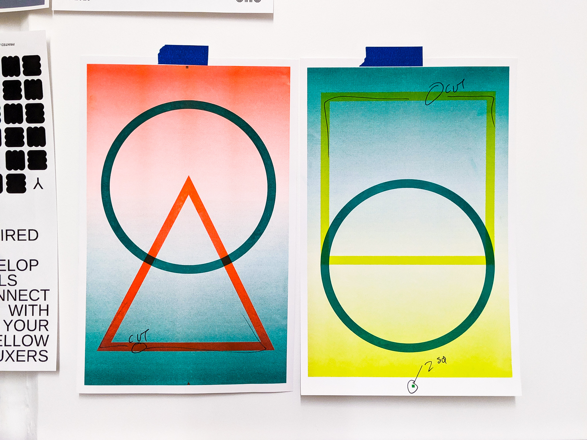

  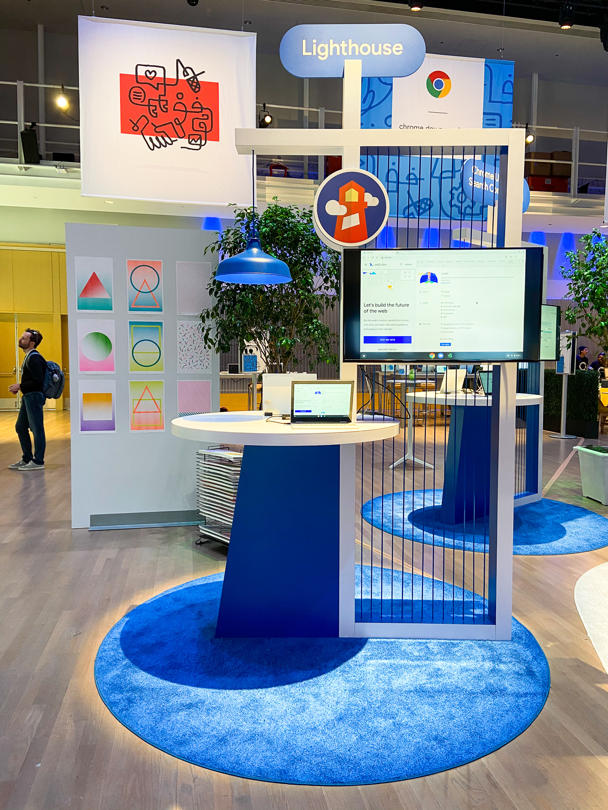
  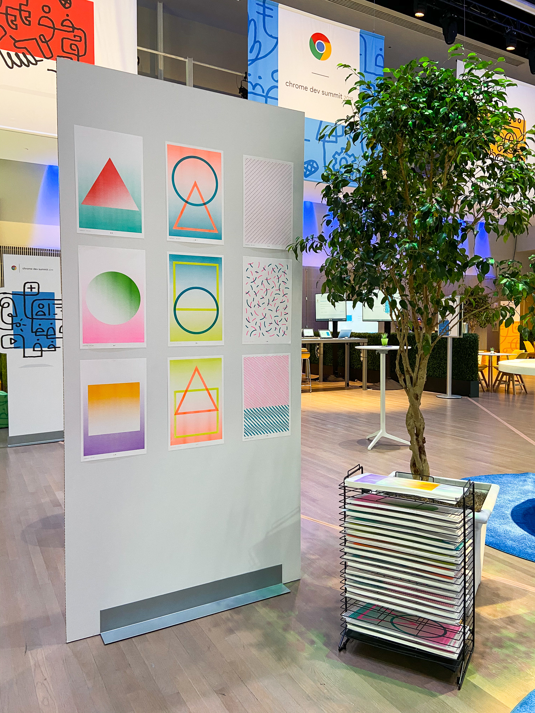

