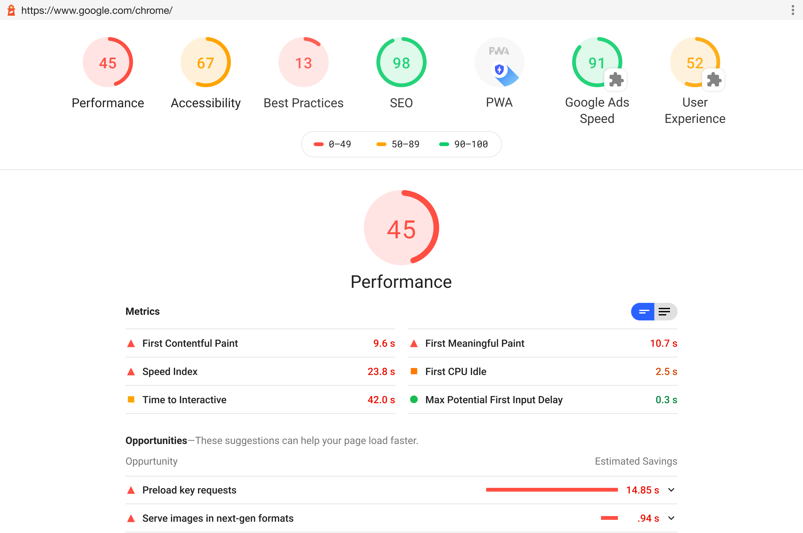
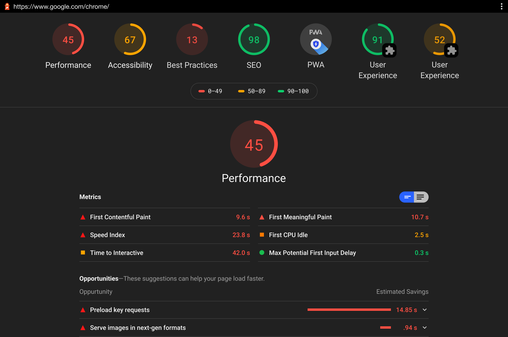
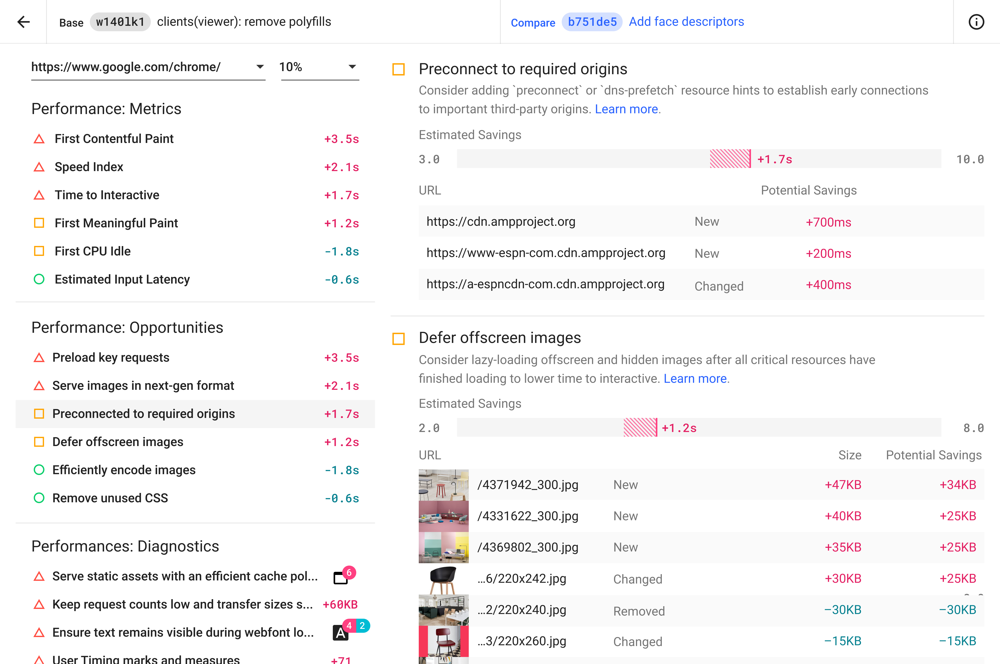

A center piece of Google Chrome's developer tools, <a href="https://developers.google.com/web/tools/lighthouse" target="_blank">Lighthouse</a> analyzes web apps and web pages, collecting modern performance metrics and insights on developer best practices. I lead the visual design refresh, and UX design for Lighthouse & Lighthouse CI in 2019.

<!--  -->

<!-- 

  
  

 -->

To promote Lighthouse at the <a href="https://developer.chrome.com/devsummit/" target="_blank">Chrome Developer Summit</a> in 2019, I designed a series of Risograph posters featuring the brand colors and graphics for display and take-away.

  
  

