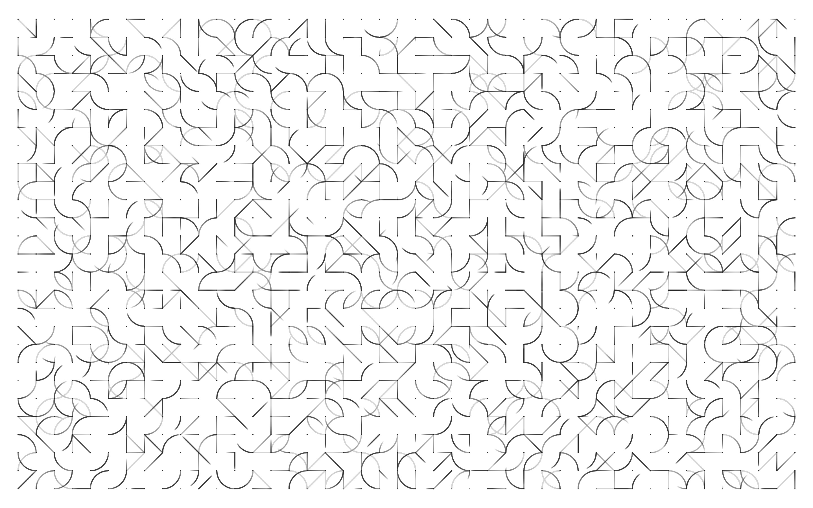
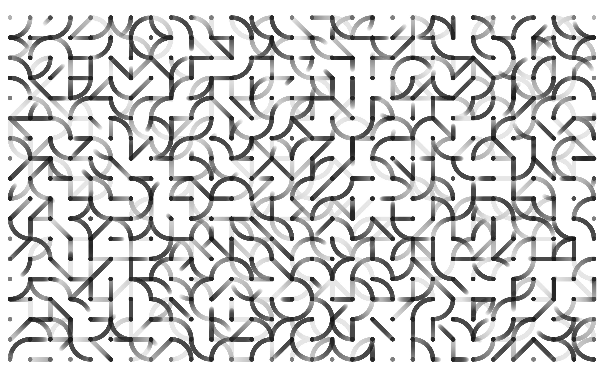
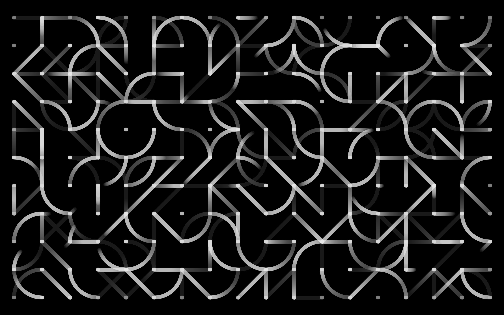
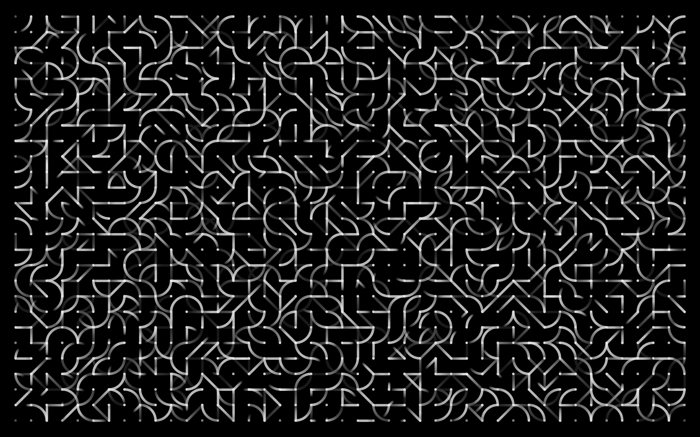
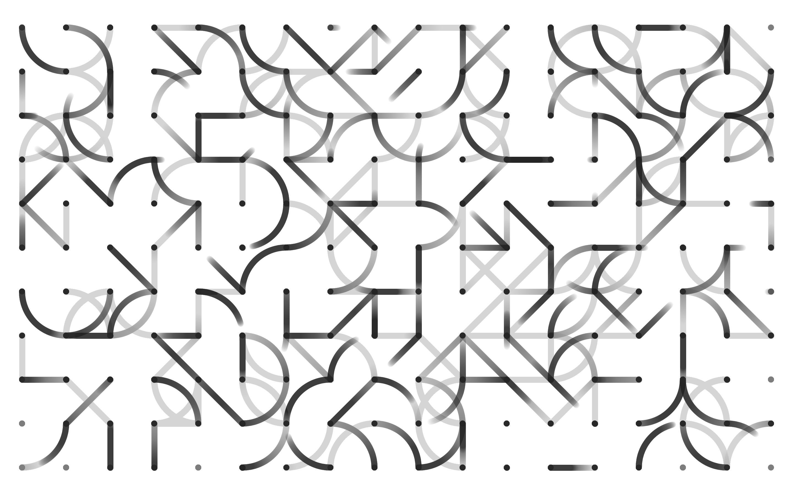

This P5.js sketch explores the interplay of lines, dots and arcs. The program dynamically generates grid size, stroke weight, velocity and color theme from the beginning and creates live drawing. See P5.js <a href="https://editor.p5js.org/yuin/sketches/SyLCrVJbN" target="_blank">sketch</a>.

