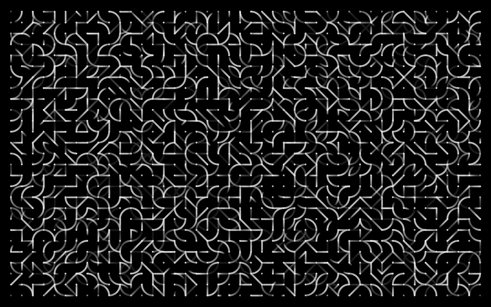
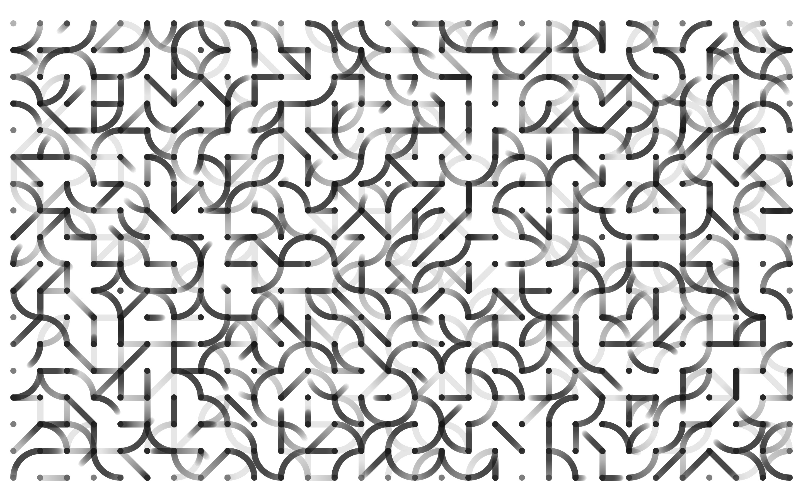
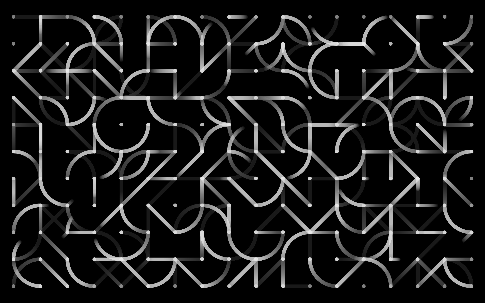
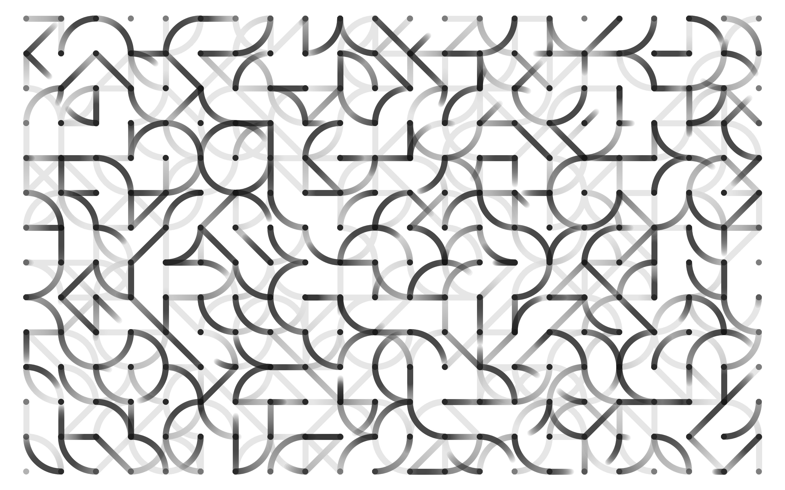
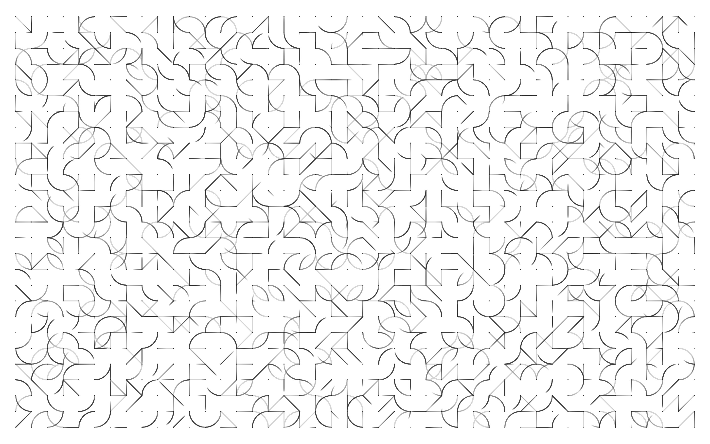
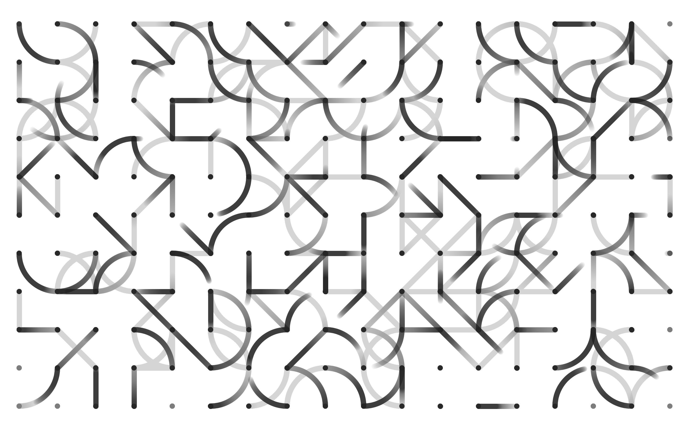

This P5.js sketch explores the interplay of lines, dots and arcs. The pattern technique also known as <a href="https://en.wikipedia.org/wiki/Truchet_tiles" target="_blank">Truchet tiles</a>. Link to sketch: <a href="https://editor.p5js.org/yuin/sketches/SyLCrVJbN" target="_blank">editor.p5js.org/yuin/sketches/SyLCrVJbN</a>.

<iframe src="https://player.vimeo.com/video/409649068?autoplay=1&loop=1&title=0&byline=0&portrait=0" style="position:absolute;top:0;left:0;width:100%;height:100%;" frameborder="0" allow="autoplay; fullscreen" allowfullscreen></iframe>

