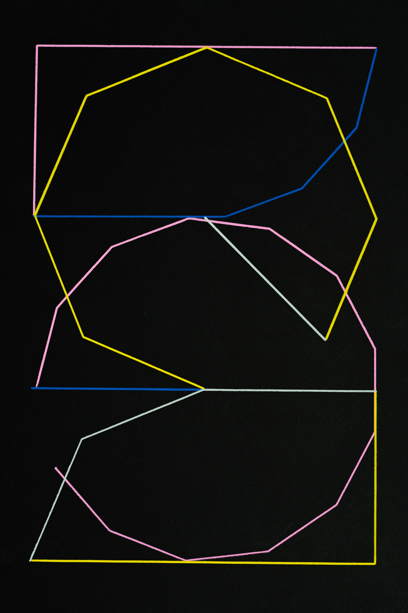
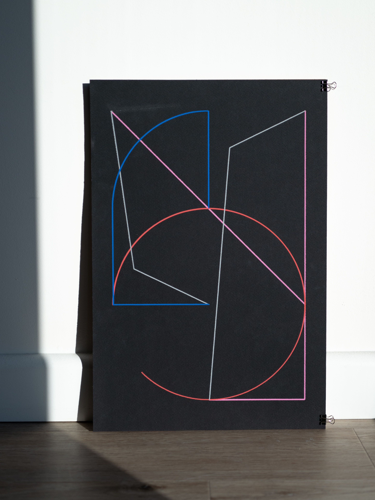
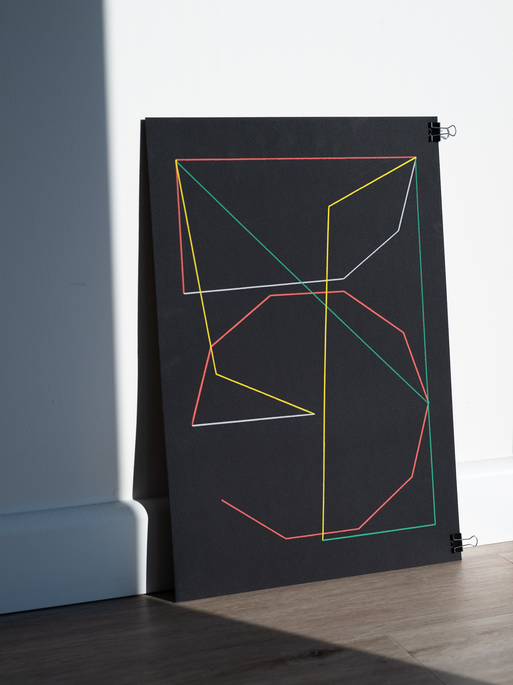
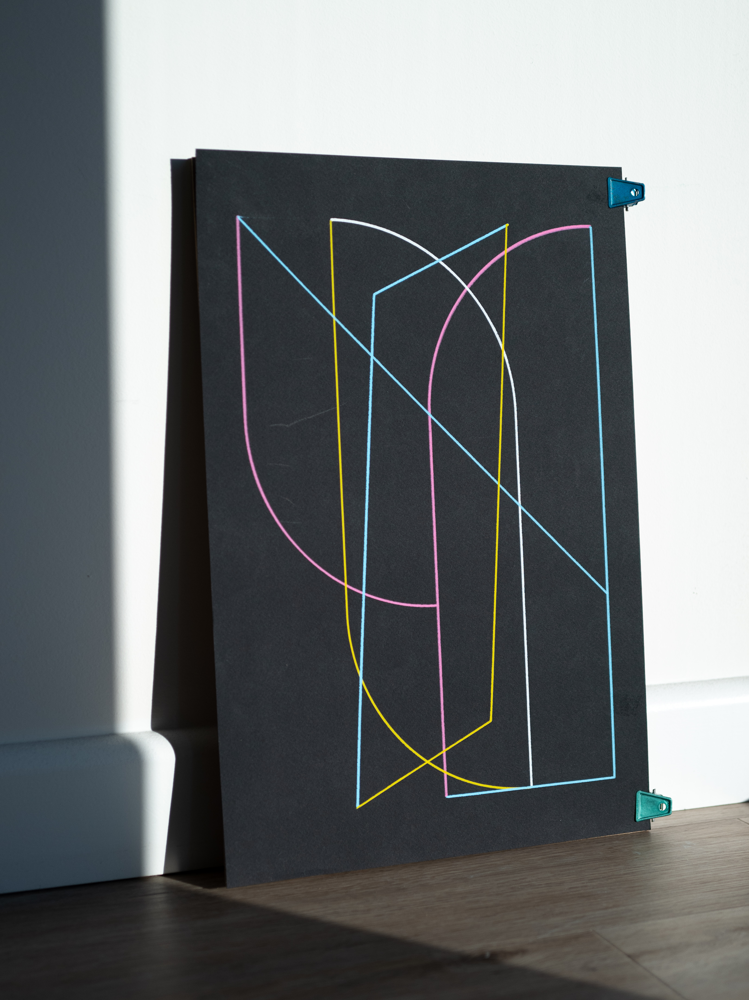

This project experiments with type design, creative coding and drawing with machine. It was a desire to create typographic drawings with my pen plotter, I designed a single stroke variable font for numerical featuring basic geometry of lines, circles and polygons. Made with html canvas and Paper.js, the type can be dynamically generated with different constructs of line weight, stroke cap, and polygon/circle shapes for wide range of visual expressions. Checkout the online <a href="https://yuinchien.com/projects/variable-font/index.html" target="_blank">type generator</a>.

I created a series of pen plotter drawings with the generative font to explore typographic compositions, abstract form, and color dynamics. The drawings are created with acrylic paint markers on black paper. Checkout the plotter drawings at <a href="https://store.yuinchien.com/" target="_blank">https://store.yuinchien.com/</a>.

<iframe src="https://player.vimeo.com/video/358239232?autoplay=1&loop=1&title=0&byline=0&portrait=0" style="position:absolute;top:0;left:0;width:100%;height:100%;" frameborder="0" allow="autoplay; fullscreen" allowfullscreen></iframe>

  
  

  
  
  

  
  

  
  

<iframe src="https://player.vimeo.com/video/367370119" style="position:absolute;top:0;left:0;width:100%;height:100%;" frameborder="0" allow="autoplay; fullscreen" allowfullscreen></iframe>

  
  

    
  

  
  

