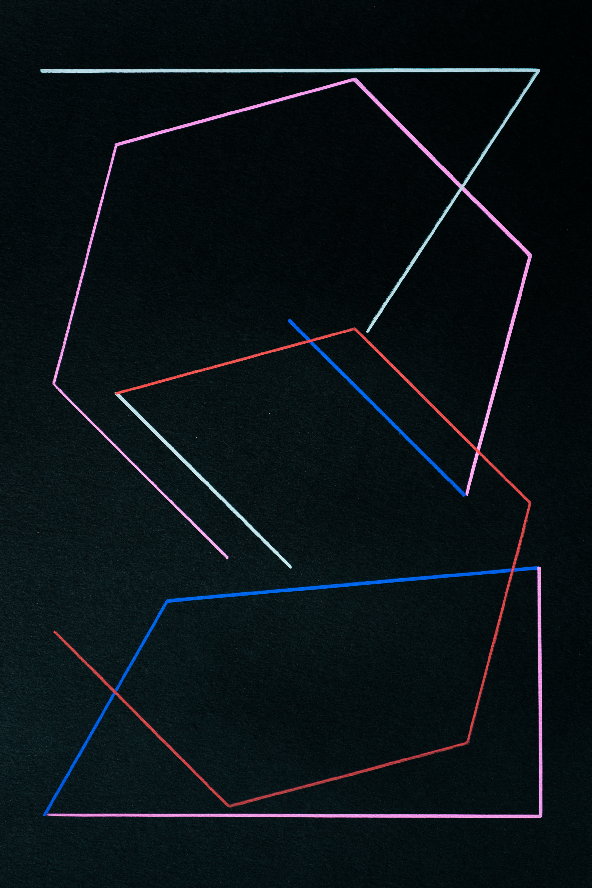
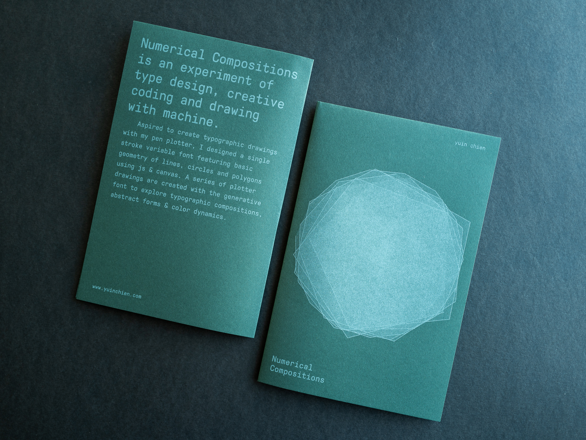
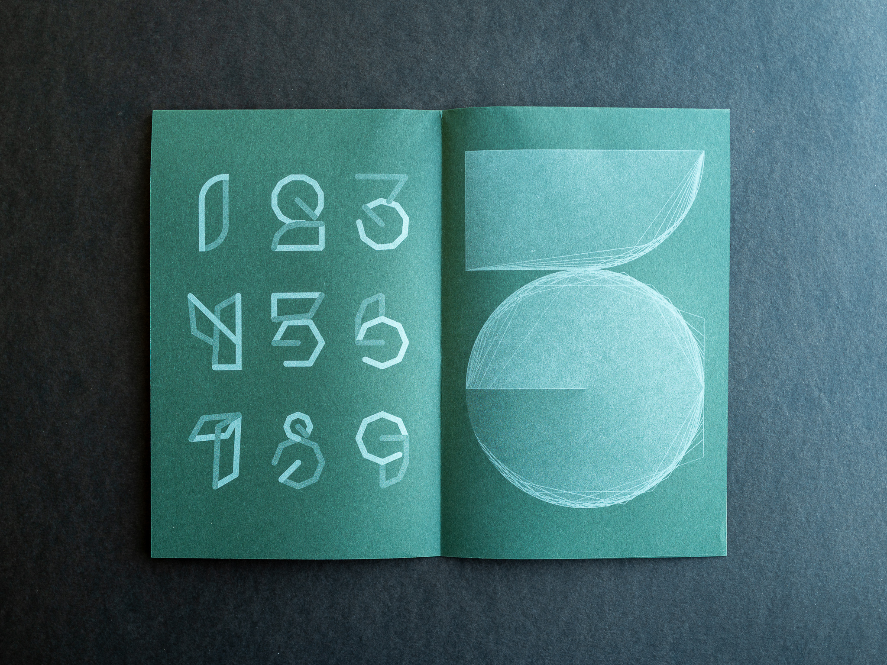

This project experiments with type design, creative coding and drawing with machine. Aspired to create typographic drawings with my pen plotter, I designed a single stroke variable font for numerical featuring basic geometry of lines, circles and polygons. Made with html canvas and Paper.js, the type can be dynamically generated with different constructs of line weight, stroke cap, and polygon/circle shapes for a wide range of visual expressions. Checkout the online <a href="https://yuinchien.com/projects/variable-font/index.html" target="_blank">type generator</a>, below is a demo video showcasing the different type variants.

<iframe src="https://player.vimeo.com/video/358239232?autoplay=1&loop=1&title=0&byline=0&portrait=0" style="position:absolute;top:0;left:0;width:100%;height:100%;" frameborder="0" allow="autoplay; fullscreen" allowfullscreen></iframe>

A series of pen plotter drawings are created with the generative font to explore typographic compositions, abstract form, and color dynamics. Made with acrylic paint markers on black paper, the drawings are available in store at <a href="https://store.yuinchien.com/" target="_blank">store.yuinchien.com</a>.

This project has been selected for <a href="https://100.sta-chicago.org/" target="_blank">STA 100</a> in 2019 by the Society of Typographic Arts institute. See the winning entry: <a href="https://100.sta-chicago.org/winners/2019/numerical-compositions" target="_blank">100.sta-chicago.org/winners/2019/numerical-compositions</a>.

<iframe src="https://player.vimeo.com/video/370559353?title=0&byline=0&portrait=0" style="position:absolute;top:0;left:0;width:100%;height:100%;" frameborder="0" allow="autoplay; fullscreen" allowfullscreen></iframe>

  
  

<!-- 

  
  
  

 -->

  
  

  
  

<iframe src="https://player.vimeo.com/video/367370119" style="position:absolute;top:0;left:0;width:100%;height:100%;" frameborder="0" allow="autoplay; fullscreen" allowfullscreen></iframe>

  
  

  
  

  
  

I created a zine to showcase this project. Risograph mist printed on 11"x17" forest green paper. 

