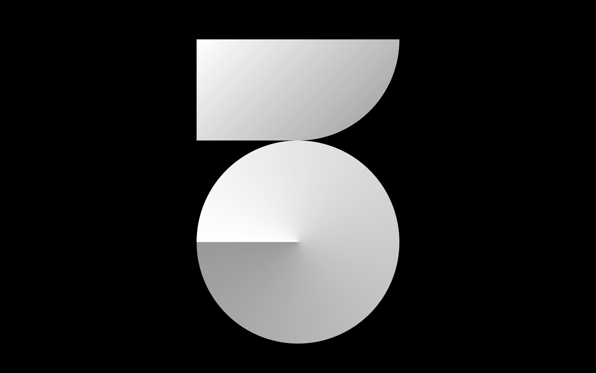
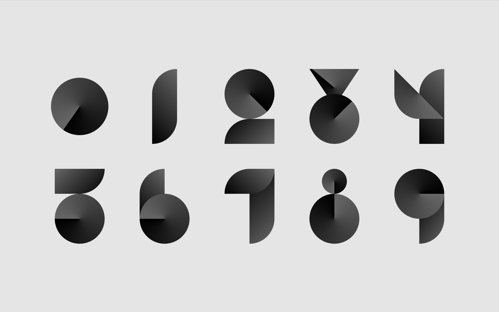
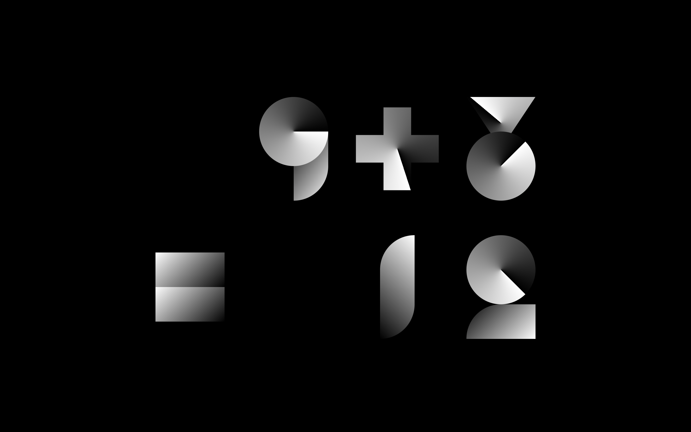

<iframe src="https://player.vimeo.com/video/408483037?autoplay=1&loop=1&title=0&byline=0&portrait=0" style="position:absolute;top:0;left:0;width:100%;height:100%;" frameborder="0" allow="autoplay; fullscreen" allowfullscreen></iframe>

Experimental type design with CSS grid and gradient. Checkout the website: <a href="https://yuinchien.com/projects/numerical/" target="_blank">yuinchien.com/projects/numerical</a>.

