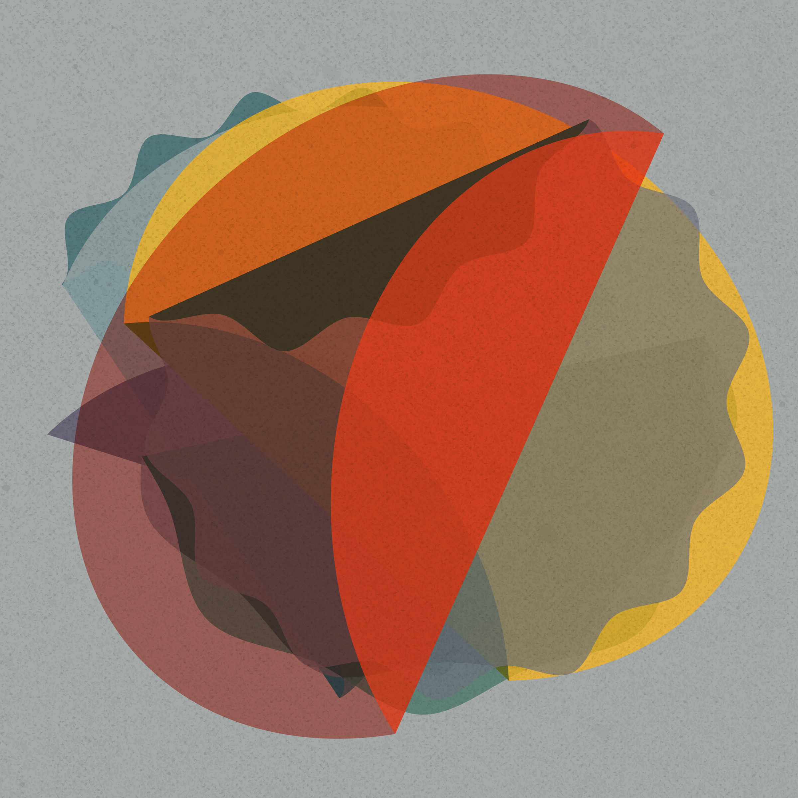
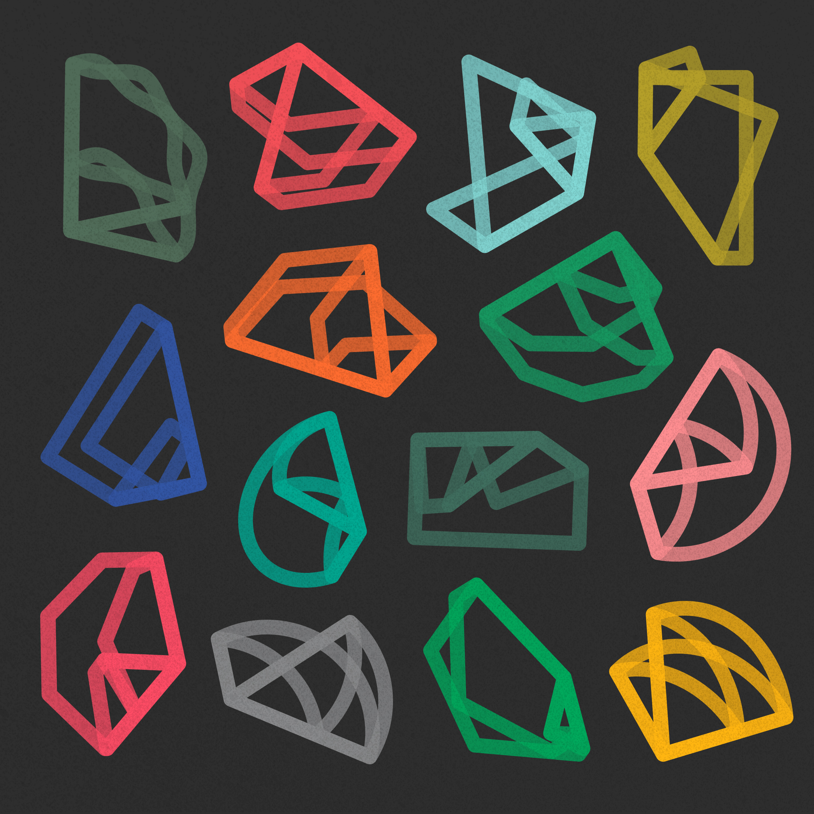
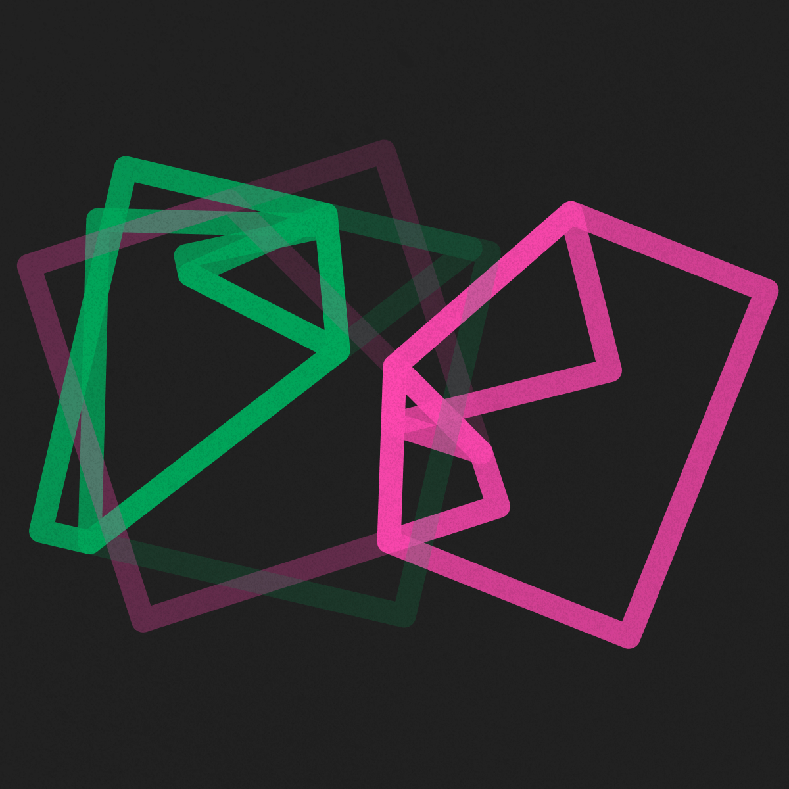
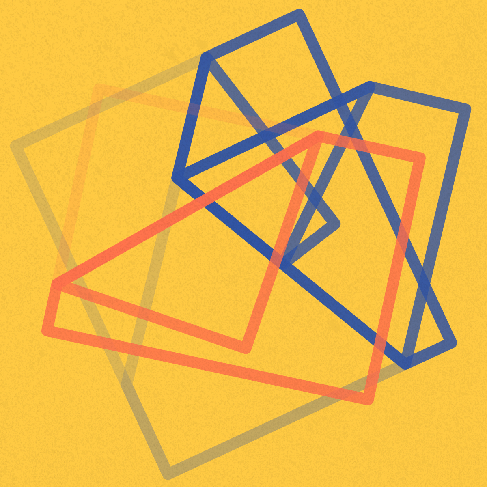
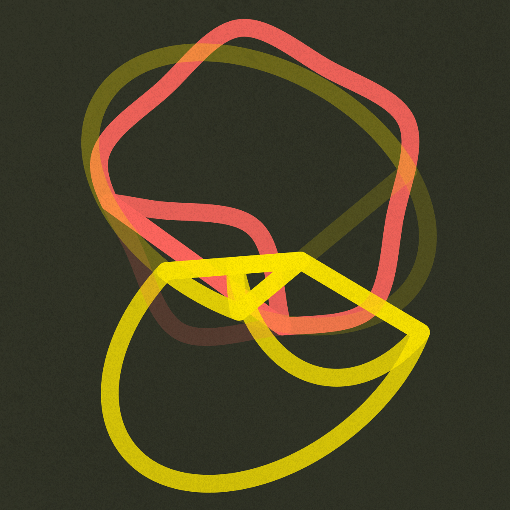
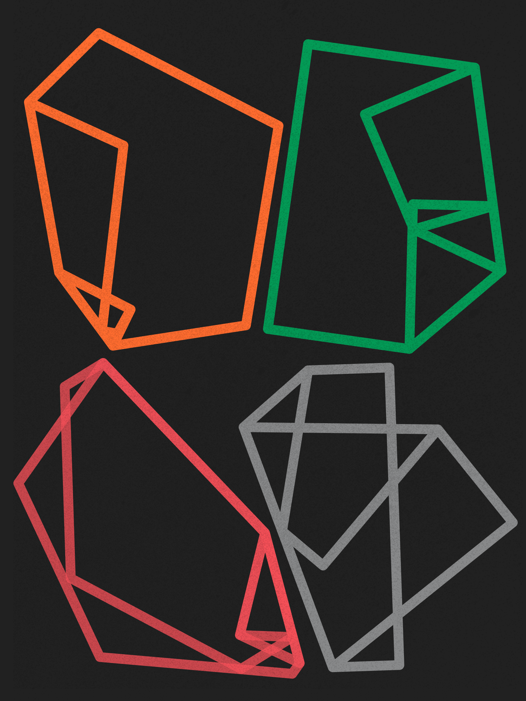
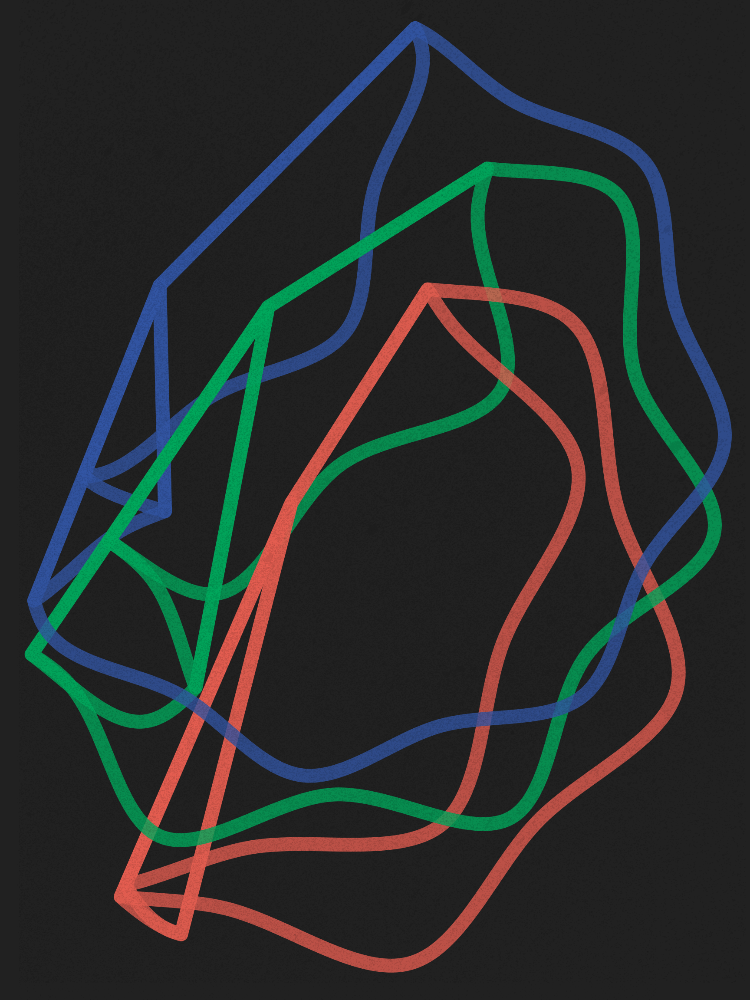

An independent study of origami to explore forms, colors and motion. Vector shapes of polygons and circles are programmed in JS to behave like paper, they fold freely to create structured layers and shapes. Checkout the live demo: <a href="https://yuinchien.com/projects/origami/" target="_blank">yuinchien.com/projects/origami</a>.

<iframe src="https://player.vimeo.com/video/386428951?autoplay=1&loop=1&title=0&byline=0&portrait=0" style="position:absolute;top:0;left:0;width:100%;height:100%;" frameborder="0" allow="autoplay; fullscreen" allowfullscreen></iframe>

A series of visual study exploring origami compositions and colors, hoping to give forms to personal memories and poetic imagination.

  
  

  
  

  
  

  
  

A demo video featuring double folding of diverse shapes. The following visual study explores origami compositions in outline strokes.

<iframe src="https://player.vimeo.com/video/386356715?title=0&byline=0&portrait=0" width="720" height="720" frameborder="0" allow="autoplay; fullscreen" allowfullscreen></iframe>

  
  

  
  

  
  

