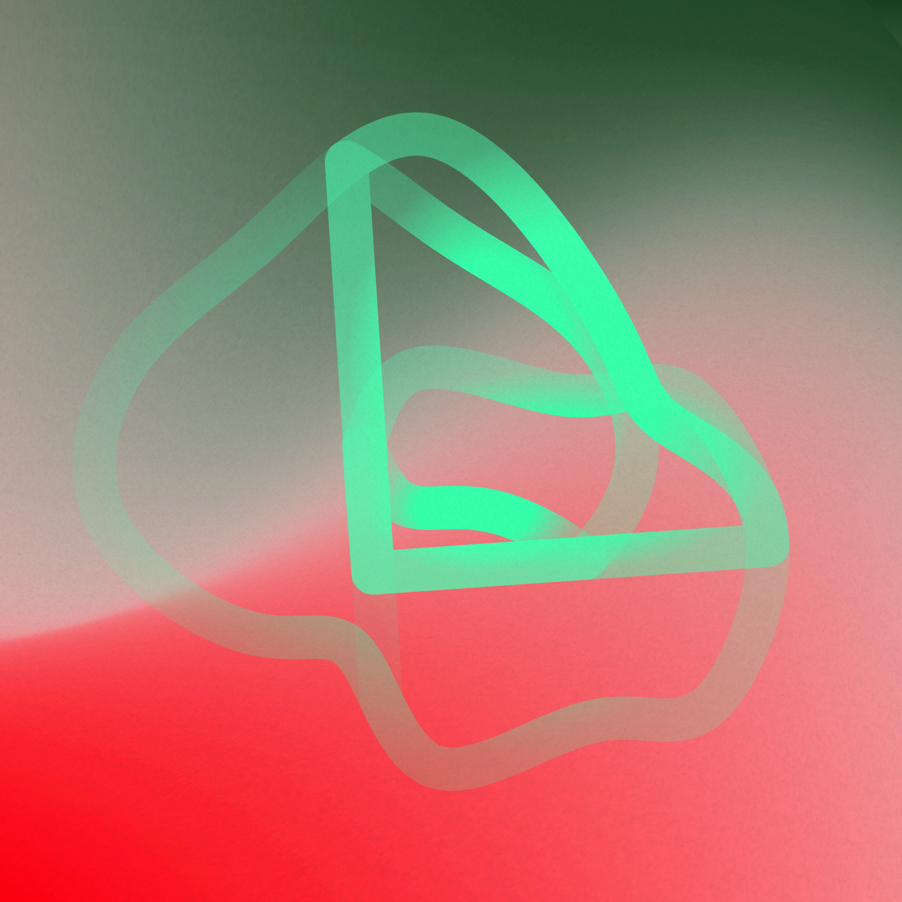
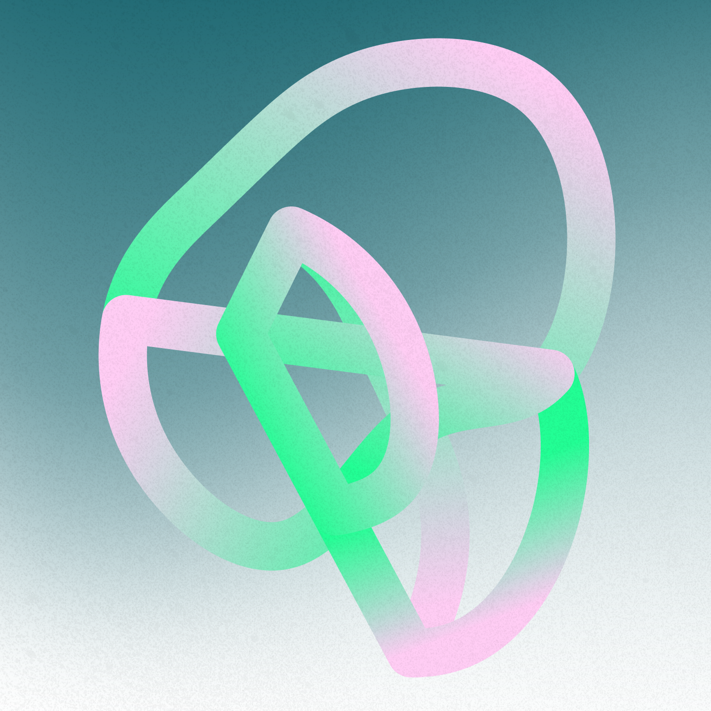
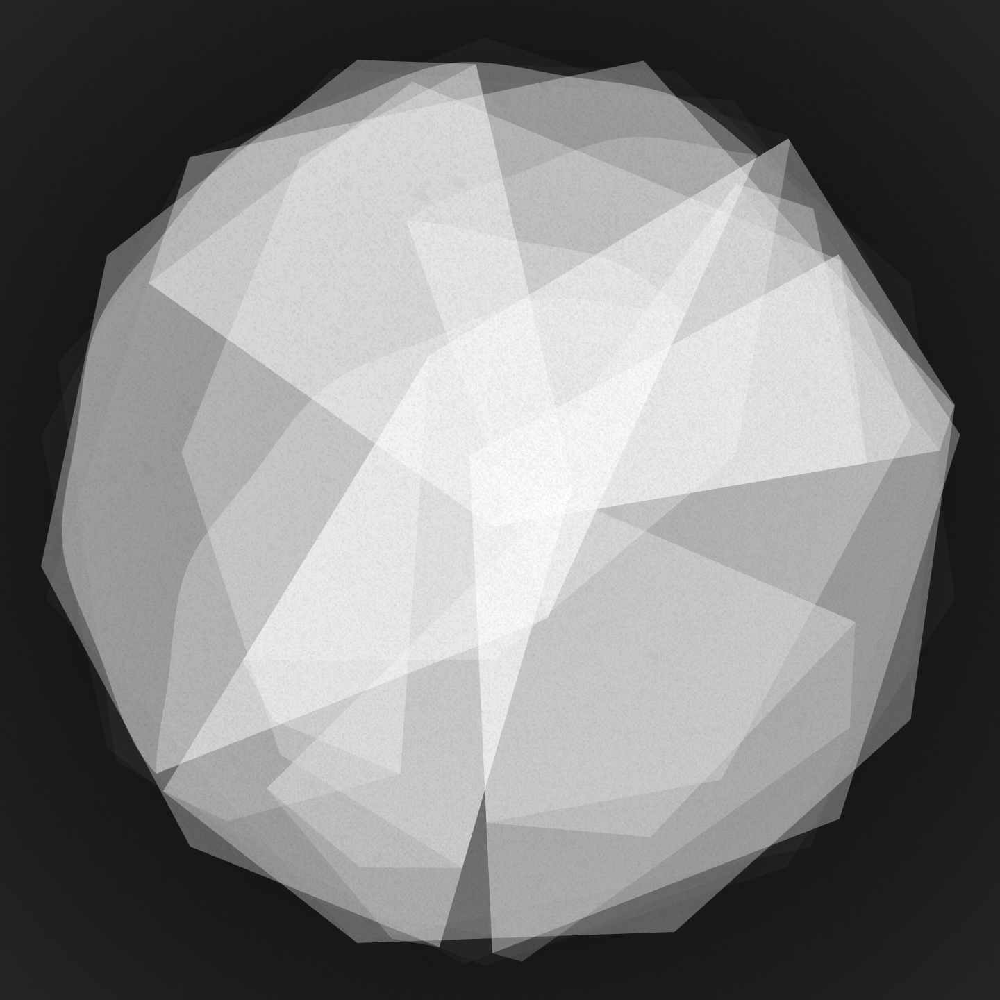
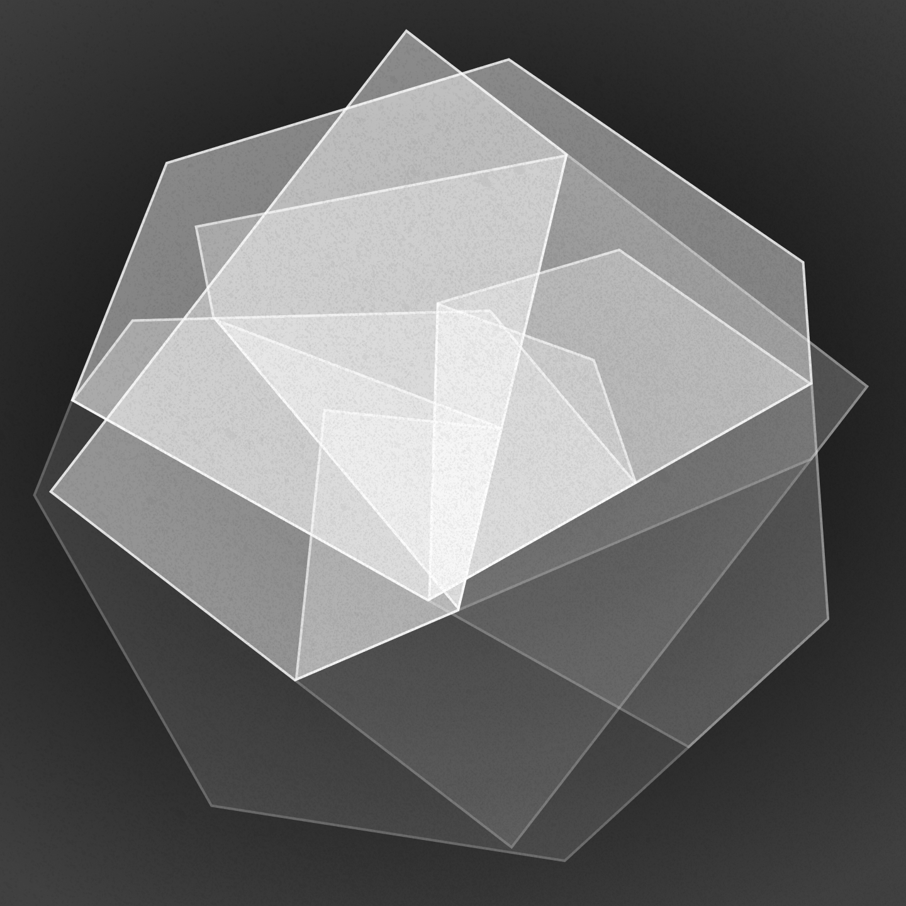
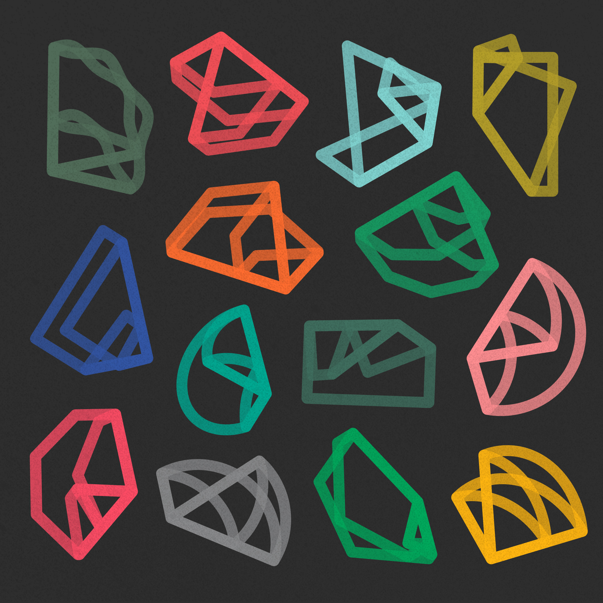
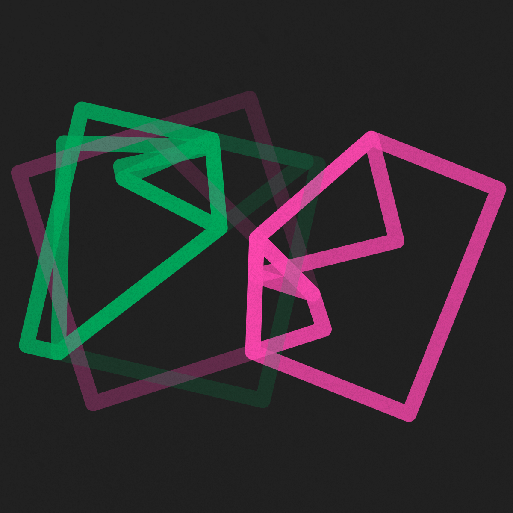
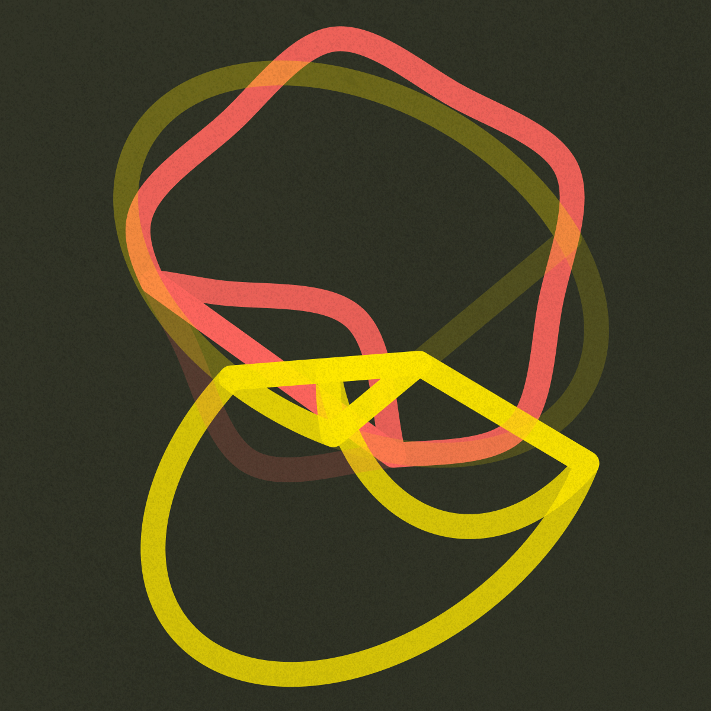
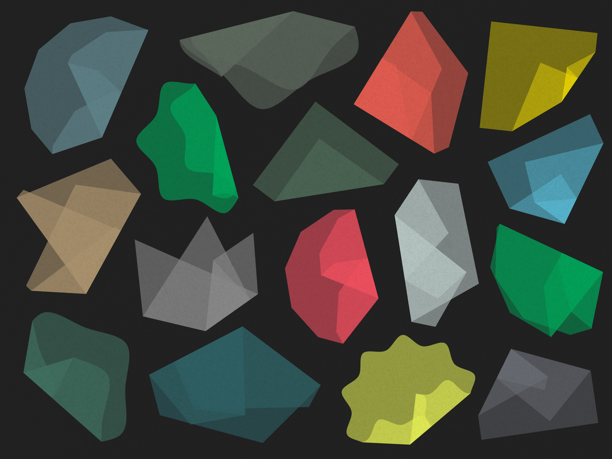
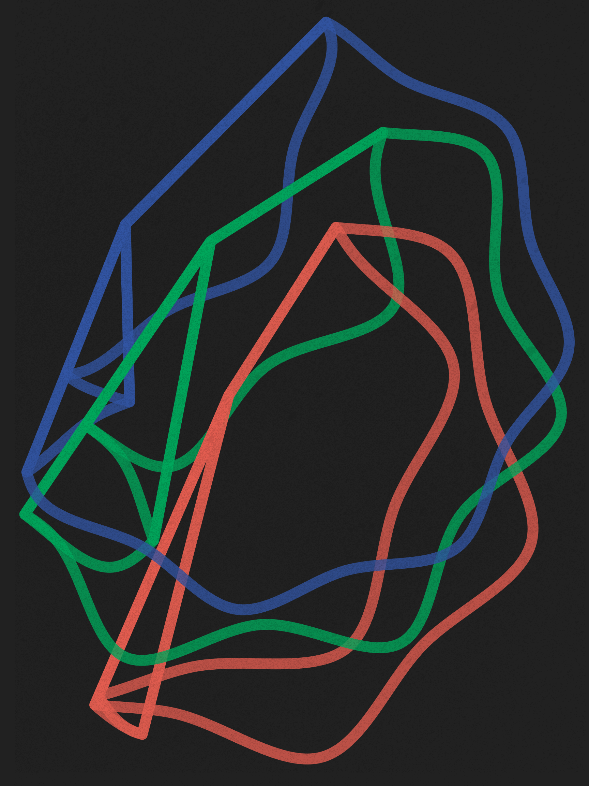

A design study of origami to explore forms, colors and motion. Primitive vectors such as polygons and circles are programmed in JS to behave like paper, they fold freely to create structured layers and shapes. Checkout the live demo: <a href="https://yuinchien.com/projects/origami/" target="_blank">yuinchien.com/projects/origami</a>.

<iframe src="https://player.vimeo.com/video/386428951?autoplay=1&loop=1&title=0&byline=0&portrait=0" style="position:absolute;top:0;left:0;width:100%;height:100%;" frameborder="0" allow="autoplay; fullscreen" allowfullscreen></iframe>

A series of visual study exploring origami compositions and colors. They are my ongoing pursuit of creating imagery for personal memories and poetic imagination.

  
  

  
  

  
  

  
  

<iframe src="https://player.vimeo.com/video/386384531?autoplay=1&loop=1&title=0&byline=0&portrait=0" style="position:absolute;top:0;left:0;width:100%;height:100%;" frameborder="0" allow="autoplay; fullscreen" allowfullscreen></iframe>

  
  

  
  

  
  

