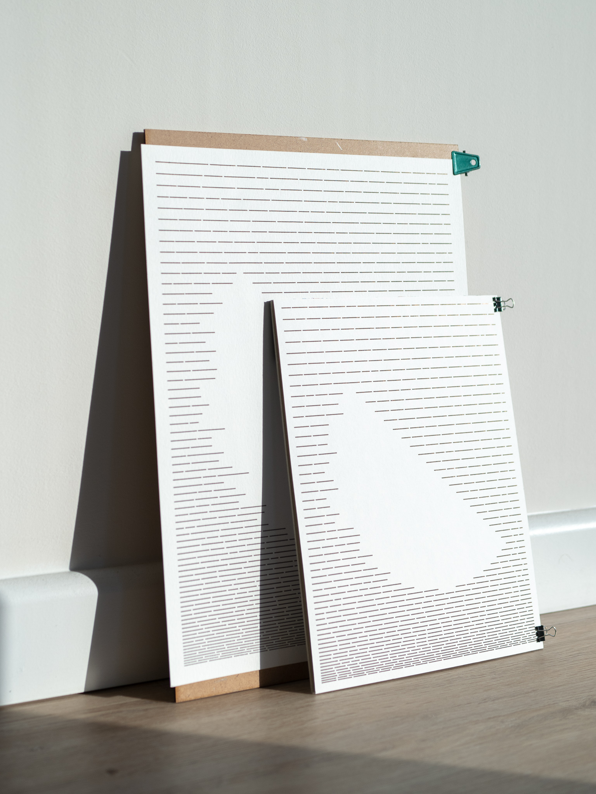
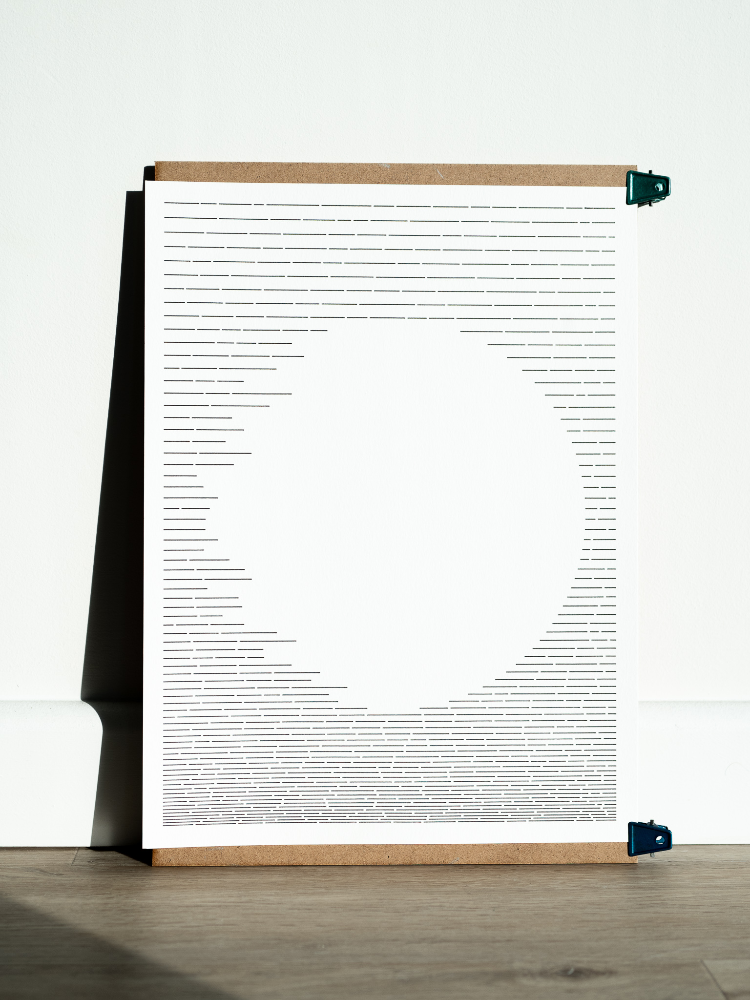
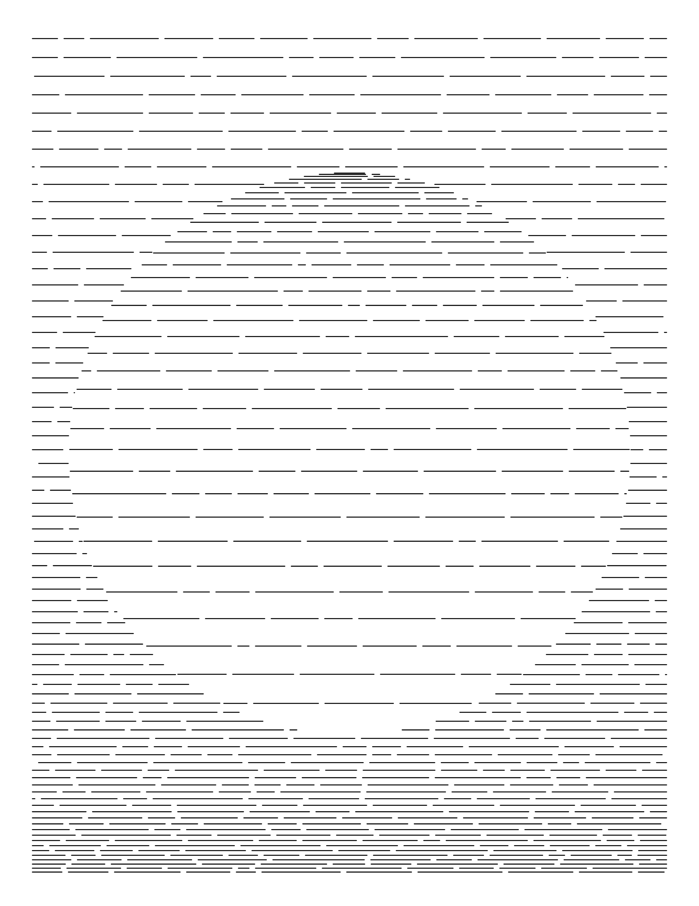
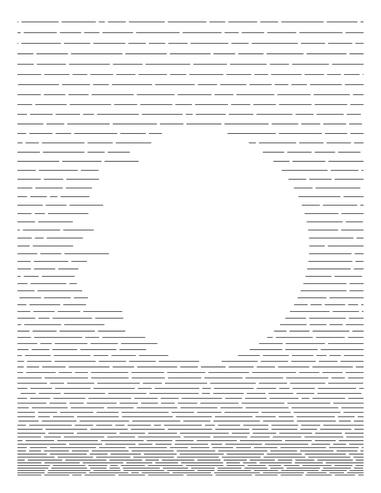
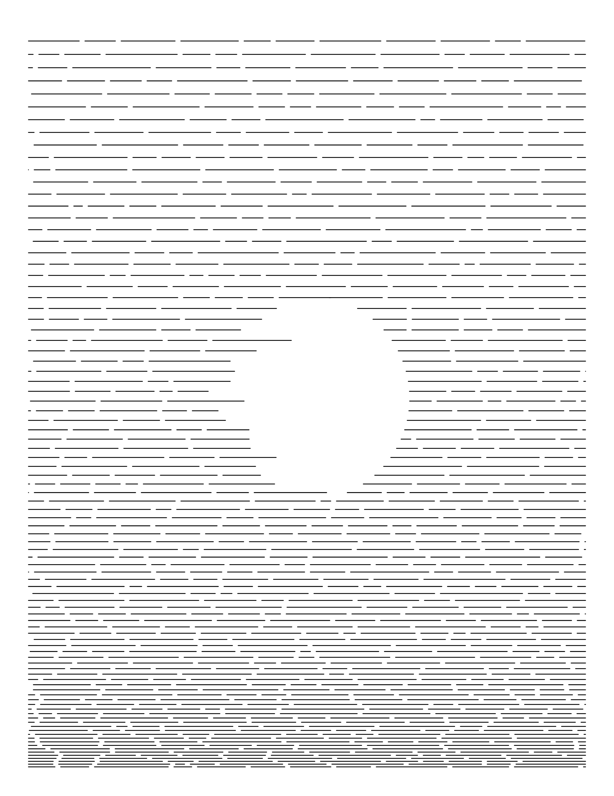
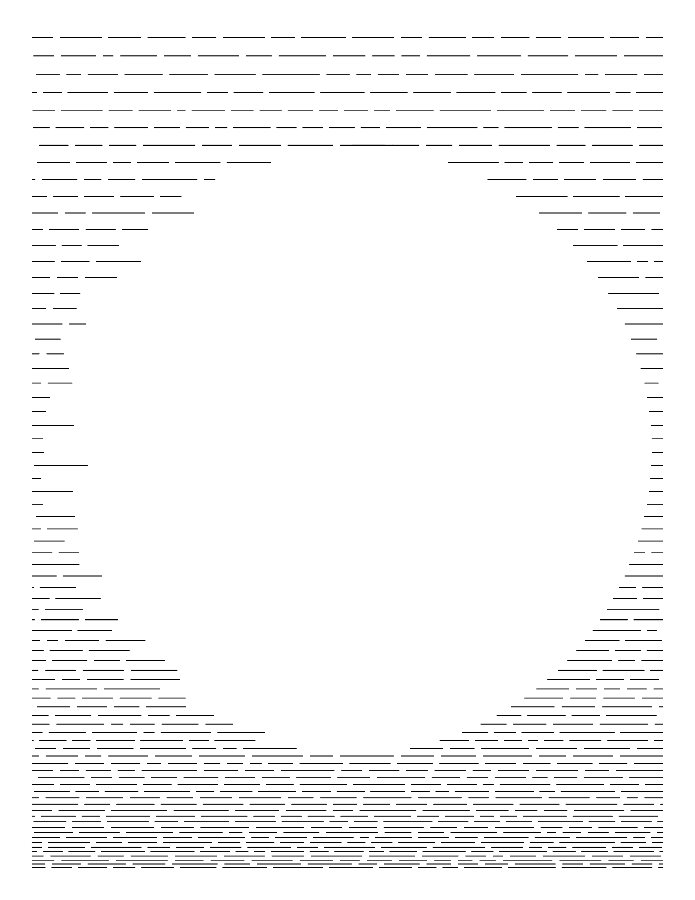
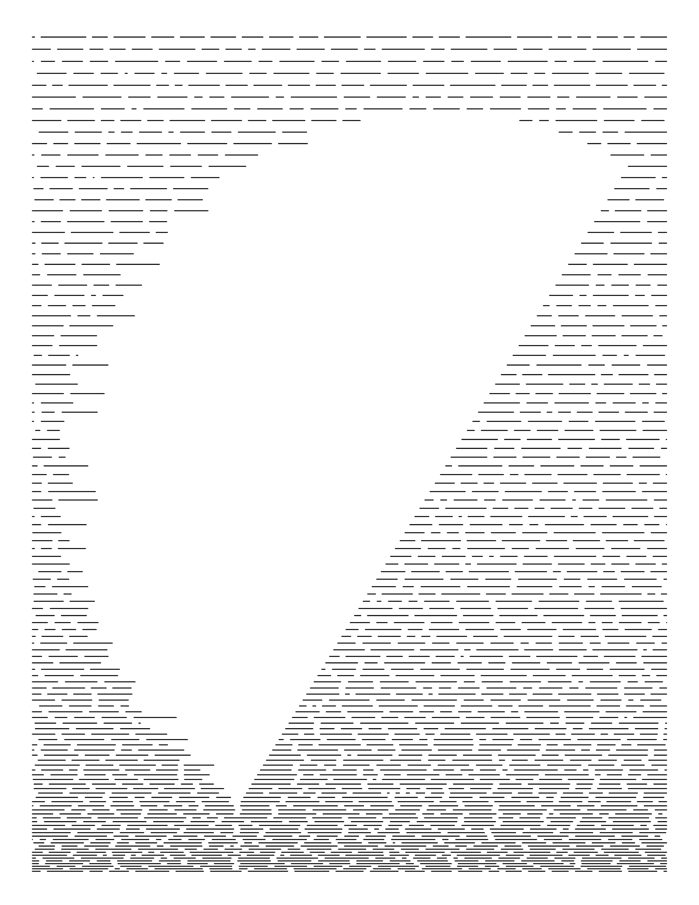
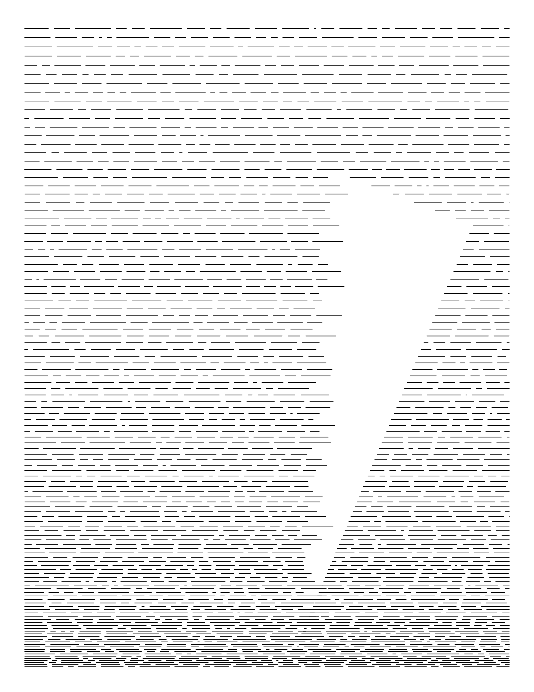
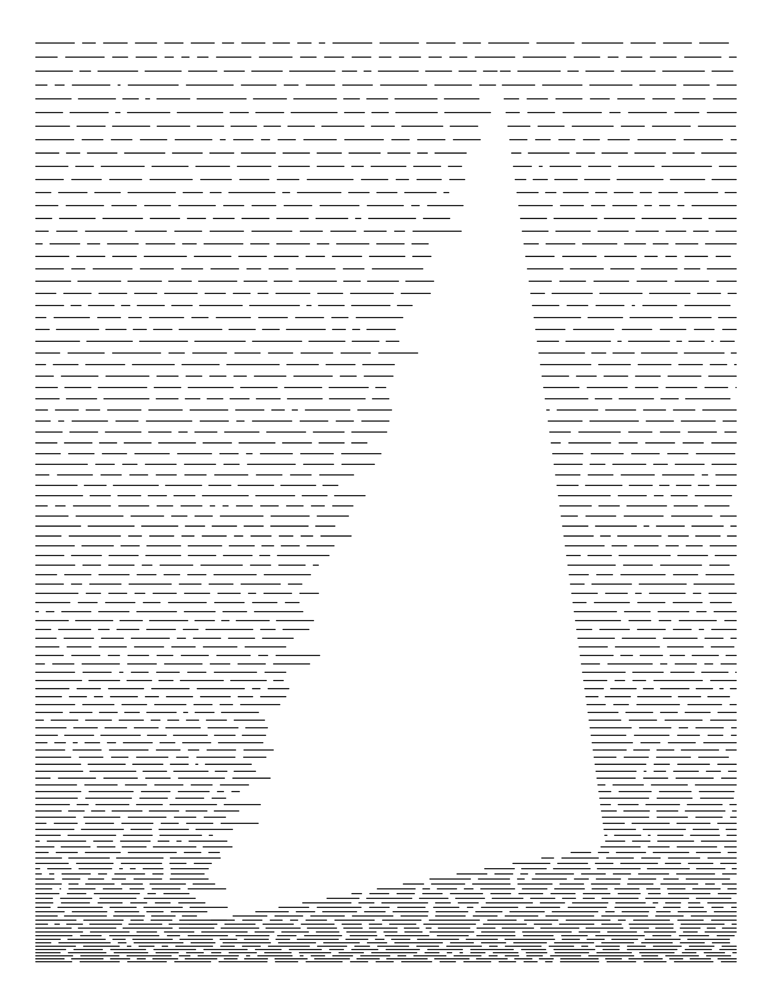

Generative drawings using html canvas & JS to explore the dynamics of density and randomness. Checkout the plotter drawings in store: <a href="http://store.yuinchien.com/store/circle-1" target="_blank">store.yuinchien.com/store/circle-1</a>.

  
  

  
  

  
  

  
  

  
  

