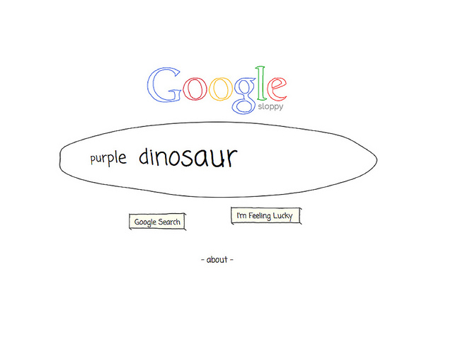

What if Google Got Lazy, dyslexic or impatient? Can an interface with its own consciousness, senses, and gestures reverse the passive role of user in Interaction Design? As the sloppy twin of Google search, the Search Operators is an experiment to challenge the traditional notion of user interfaces.

<iframe src="https://player.vimeo.com/video/20571211?title=0&byline=0&portrait=0" style="position:absolute;top:0;left:0;width:100%;height:100%;" frameborder="0" allow="autoplay; fullscreen" allowfullscreen></iframe>

The Search Operators opens up a narrative space inhabited by three sloppy agents - Jarek, Remo, and the yawning Surina - which allows people to speculate upon an emotional reality within technology. It breaks the patterns of usability and pure functionalism, by creating narrative space within interactions.

  
  

My remixing experiments introduce a playful aesthetic to familiar interfaces, which afford open reflections and interpretations. Remix Interactions are mash-ups of hacked web technology and humanistic expressions: a radical response to patterns of interface design which predicts human behavior. The work opens up space for people to speculate about human condition in the digital age.

Selected Press:

* ['Sloppy Google' Is Lazy And Incompetent, Like A Human](https://techcrunch.com/2011/03/02/youre-sitting-in-a-chair-in-the-sky/) – TechCrunch
* [Sloppy Google: What If Google Got Lazy?](http://www.huffingtonpost.com/2011/03/04/sloppy-google_n_831596.html) – Huffington Post
* [Meet Google's Evil Twin, Google Sloppy](http://mashable.com/2011/03/04/google-sloppy-video/) – Mashable
