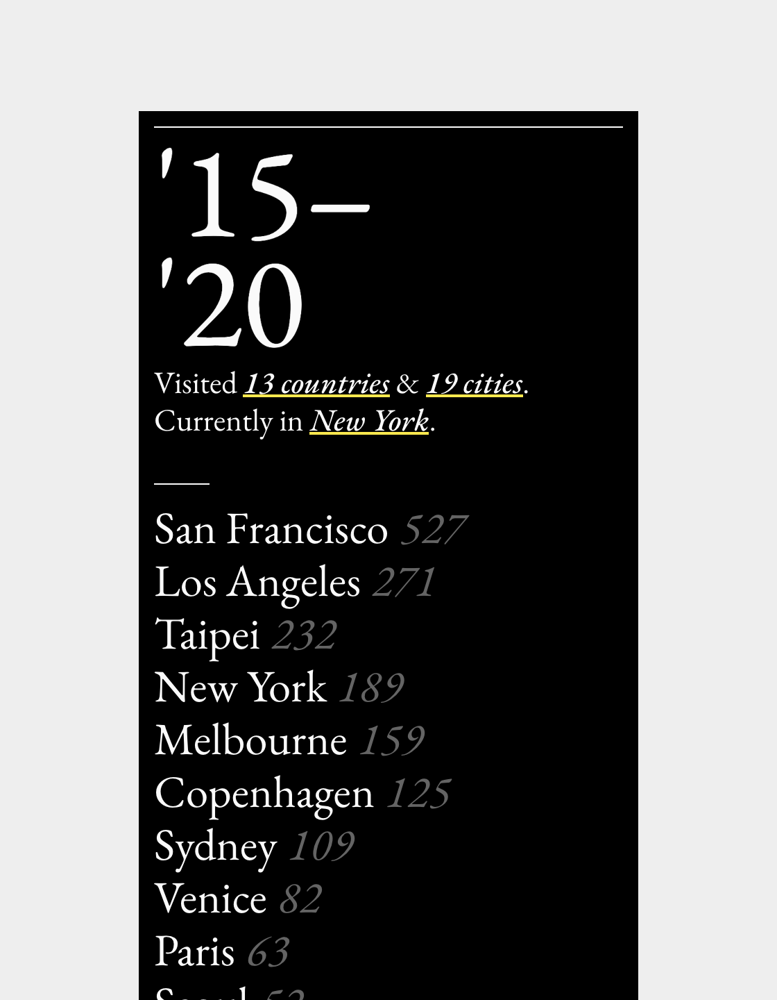

An open source sheet-to-site template for personal travel log. This project aims to surface travel patterns that might be hidden and shed new light on the relationship between people and places. The template is open sourced under MIT license on <a href="https://github.com/yuinchien/traces.report" target="_blank">Github</a>. Project website: <a href="https://traces.report" target="_blank">https://traces.report</a>.

  
  

The color theme reflects local time of the viewer. 

Built with Google <a href="https://developers.google.com/sheets/api" target="_blank">Sheets API</a>.

