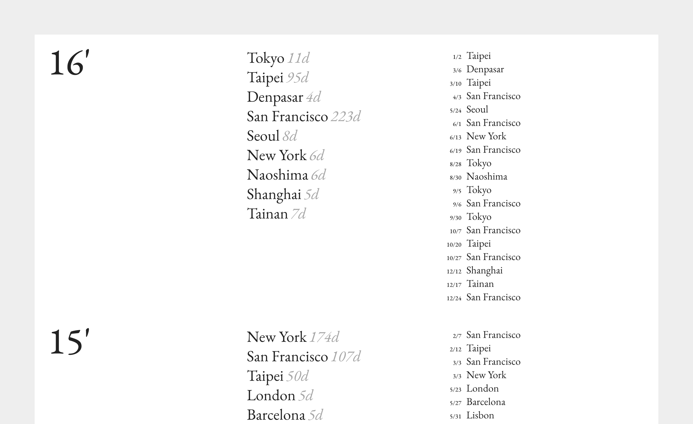
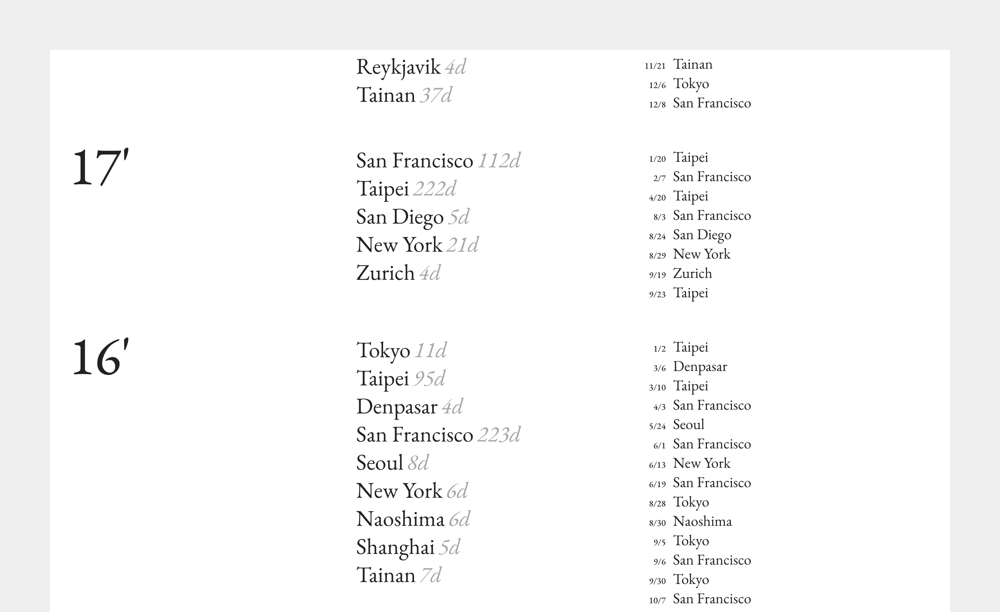

I keep my travel records in a Google Spreadsheet, tracking the cities and dates over the years. A website has been created to visualize the data: <a href="https://yuinchien.com/projects/travel-log/" target="_blank">yuinchien.com/projects/travel-log</a>.

  
  

