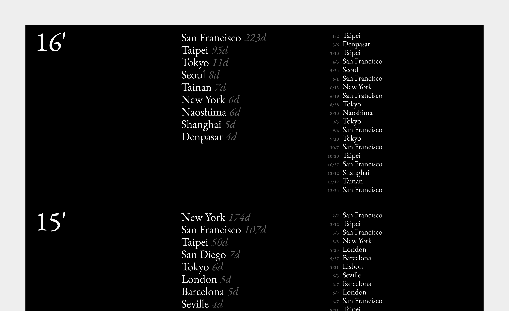

I keep my travel records in a Google Spreadsheet to track the cities and dates over the years. The website design aims to present the geo data in meaningful ways, for example the color theme reflects my current local time (day/night time). Link to website: <a href="https://yuinchien.com/projects/travel-log/" target="_blank">yuinchien.com/projects/travel-log</a>.

  
  

