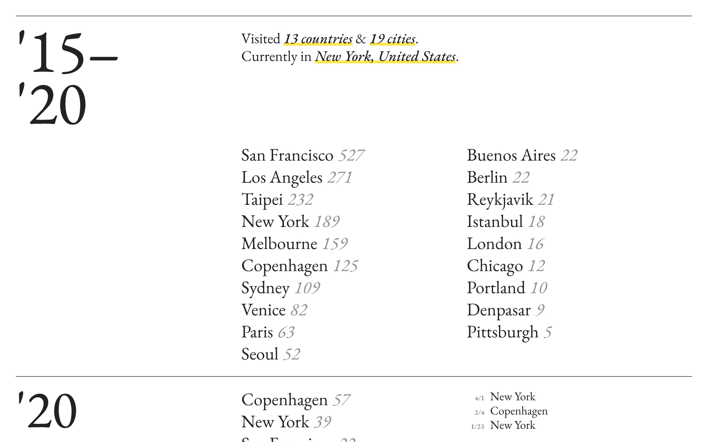
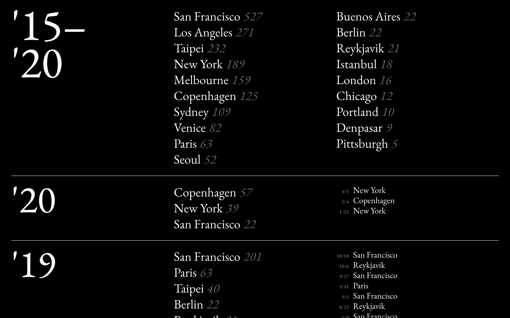

An open source sheet-to-site template for personal travel log. This project aims to surface travel patterns that might be hidden and shed new light on the relationship between people and places. The template is open sourced under MIT license on <a href="https://github.com/yuinchien/traces.report" target="_blank">Github</a>. Checkout the sample website generated from the spreadsheet: <a href="https://traces.report" target="_blank">https://traces.report</a>.

  
  

The color theme corresponds to the local day/night time of the viewer. Information are organized chronologically and abstracted for mobile screen to optimize user experience.

I've been keeping travel records in a Google Spreadsheet for many years, and this project has evolved over time. The current design enables me to reflect on my personal history and the relationship with different places I've lived, visited and left. 

It was a lovely surprise to open source the project, I hope more people can enjoy it like I have. Create and access your personal Travel Log at <a href="https://traces.report/me" target="_blank">traces.report/me</a> by following the instructions on <a href="https://github.com/yuinchien/traces.report" target="_blank">Github</a>.

